* Table of Contents
{:toc}

--------------------------------------------------------------------------------------------------------------------

## **Setting up, getting started**

Refer to the guide [_Setting up and getting started_](SettingUp.md).

--------------------------------------------------------------------------------------------------------------------

## **Design**

:bulb: **Tip:** The `.puml` files used to create diagrams are in this document `docs/diagrams` folder. Refer to the [_PlantUML Tutorial_ at se-edu/guides](https://se-education.org/guides/tutorials/plantUml.html) to learn how to create and edit diagrams.

### Architecture

The ***Architecture Diagram*** given above explains the high-level design of the App.

Given below is a quick overview of main components and how they interact with each other.

**Main components of the architecture**

**`Main`** (consisting of classes [`Main`](https://github.com/se-edu/addressbook-level3/tree/master/src/main/java/seedu/address/Main.java) and [`MainApp`](https://github.com/se-edu/addressbook-level3/tree/master/src/main/java/seedu/address/MainApp.java)) is in charge of the app launch and shut down.
* At app launch, it initializes the other components in the correct sequence, and connects them up with each other.
* At shut down, it shuts down the other components and invokes cleanup methods where necessary.

The bulk of the app's work is done by the following four components:

* [**`UI`**](#ui-component): The UI of the App.
* [**`Logic`**](#logic-component): The command executor.
* [**`Model`**](#model-component): Holds the data of the App in memory.
* [**`Storage`**](#storage-component): Reads data from, and writes data to, the hard disk.

[**`Commons`**](#common-classes) represents a collection of classes used by multiple other components.

**How the architecture components interact with each other**

The *Sequence Diagram* below shows how the components interact with each other for the scenario where the user issues the command `delete 1`.

Each of the four main components (also shown in the diagram above),

* defines its *API* in an `interface` with the same name as the Component.
* implements its functionality using a concrete `{Component Name}Manager` class (which follows the corresponding API `interface` mentioned in the previous point.

For example, the `Logic` component defines its API in the `Logic.java` interface and implements its functionality using the `LogicManager.java` class which follows the `Logic` interface. Other components interact with a given component through its interface rather than the concrete class (reason: to prevent outside component's being coupled to the implementation of a component), as illustrated in the (partial) class diagram below.

The sections below give more details of each component.

### UI component

The **API** of this component is specified in [`Ui.java`](https://github.com/se-edu/addressbook-level3/tree/master/src/main/java/seedu/address/ui/Ui.java)

The UI consists of a `MainWindow` that is made up of parts e.g.`CommandBox`, `ResultDisplay`, `PersonListPanel`, `StatusBarFooter` etc. All these, including the `MainWindow`, inherit from the abstract `UiPart` class which captures the commonalities between classes that represent parts of the visible GUI.

The `UI` component uses the JavaFx UI framework. The layout of these UI parts are defined in matching `.fxml` files that are in the `src/main/resources/view` folder. For example, the layout of the [`MainWindow`](https://github.com/se-edu/addressbook-level3/tree/master/src/main/java/seedu/address/ui/MainWindow.java) is specified in [`MainWindow.fxml`](https://github.com/se-edu/addressbook-level3/tree/master/src/main/resources/view/MainWindow.fxml)

The `UI` component,

* executes user commands using the `Logic` component.
* listens for changes to `Model` data so that the UI can be updated with the modified data.
* keeps a reference to the `Logic` component, because the `UI` relies on the `Logic` to execute commands.
* depends on some classes in the `Model` component, as it displays `Person` object residing in the `Model`.

### Logic component

**API** : [`Logic.java`](https://github.com/se-edu/addressbook-level3/tree/master/src/main/java/seedu/address/logic/Logic.java)

Here's a (partial) class diagram of the `Logic` component:

The sequence diagram below illustrates the interactions within the `Logic` component, taking `execute("delete 1")` API call as an example.

:information_source: **Note:** The lifeline for `DeleteCommandParser` should end at the destroy marker (X) but due to a limitation of PlantUML, the lifeline continues till the end of diagram.

How the `Logic` component works:

1. When `Logic` is called upon to execute a command, it is passed to an `AddressBookParser` object which in turn creates a parser that matches the command (e.g., `DeleteCommandParser`) and uses it to parse the command.
1. This results in a `Command` object (more precisely, an object of one of its subclasses e.g., `DeleteCommand`) which is executed by the `LogicManager`.
1. The command can communicate with the `Model` when it is executed (e.g. to delete a person). 
   Note that although this is shown as a single step in the diagram above (for simplicity), in the code it can take several interactions (between the command object and the `Model`) to achieve.
1. The result of the command execution is encapsulated as a `CommandResult` object which is returned back from `Logic`.

Here are the other classes in `Logic` (omitted from the class diagram above) that are used for parsing a user command:

How the parsing works:
* When called upon to parse a user command, the `AddressBookParser` class creates an `XYZCommandParser` (`XYZ` is a placeholder for the specific command name e.g., `AddCommandParser`) which uses the other classes shown above to parse the user command and create a `XYZCommand` object (e.g., `AddCommand`) which the `AddressBookParser` returns back as a `Command` object.
* All `XYZCommandParser` classes (e.g., `AddCommandParser`, `DeleteCommandParser`, ...) inherit from the `Parser` interface so that they can be treated similarly where possible e.g, during testing.

### Model component
**API** : [`Model.java`](https://github.com/se-edu/addressbook-level3/tree/master/src/main/java/seedu/address/model/Model.java)

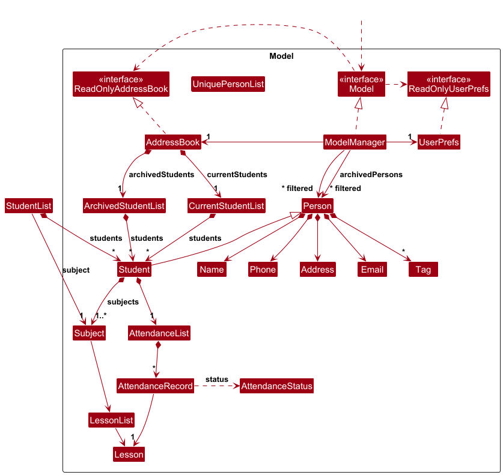

The `Model` component,

* stores the address book data i.e., all `Person` objects (which are contained in a `UniquePersonList` object).
* stores the currently 'selected' `Person` objects (e.g., results of a search query) as a separate _filtered_ list which is exposed to outsiders as an unmodifiable `ObservableList<Person>` that can be 'observed' e.g. the UI can be bound to this list so that the UI automatically updates when the data in the list change.
* stores a `UserPref` object that represents the user’s preferences. This is exposed to the outside as a `ReadOnlyUserPref` objects.
* does not depend on any of the other three components (as the `Model` represents data entities of the domain, they should make sense on their own without depending on other components)

:information_source: **Note:** An alternative (arguably, a more OOP) model is given below. It has a `Tag` list in the `AddressBook`, which `Person` references. This allows `AddressBook` to only require one `Tag` object per unique tag, instead of each `Person` needing their own `Tag` objects. 

### Storage component

**API** : [`Storage.java`](https://github.com/se-edu/addressbook-level3/tree/master/src/main/java/seedu/address/storage/Storage.java)

The `Storage` component,
* can save both address book data and user preference data in JSON format, and read them back into corresponding objects.
* inherits from both `AddressBookStorage` and `UserPrefStorage`, which means it can be treated as either one (if only the functionality of only one is needed).
* depends on some classes in the `Model` component (because the `Storage` component's job is to save/retrieve objects that belong to the `Model`)

### Common classes

Classes used by multiple components are in the `seedu.address.commons` package.

--------------------------------------------------------------------------------------------------------------------

## **Implementation**

This section describes some noteworthy details on how certain features are implemented.

### Add Student feature

The add student feature allows TutorTrack to add students to a list of students.

#### Implementation

The add student command mechanism is facilitated by the `AddCommandParser` class which implements the `Parser` interface.
`AddCommandParser#parse()` is exposed in the `Parser` interface as `Parser#parse()`.

`AddCommandParser` implements the following operations:
* `AddCommandParser#parse()` — Parses the input arguments by first extracting quoted names (to handle names with `s/o` or `d/o`), then storing the prefixes and their respective values as an `ArgumentMultimap`. It creates a new `AddCommand` object with the parsed name, class, subjects, emergency contact, and optional payment status and assignment status. Names must be enclosed in quotes (e.g., `n/"John Tan"`) to ensure proper parsing, especially for names containing `s/o` or `d/o`.

The `AddCommand` object then communicates with the `Model` API by calling the `Model#addPerson(Person)` method, which adds the newly-constructed student to the existing student list.

The method `AddCommand#execute()` returns a `CommandResult` object, which stores information about the completion of the command.

The sequence diagram below demonstrates how the add command works.
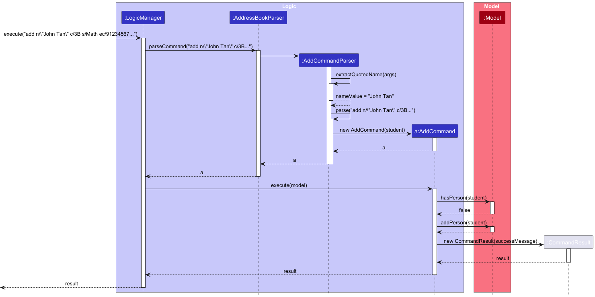

**Example Usage:**

Given below is an example usage scenario and how the add command behaves at each step.

**Step 1.** The user executes `add n/"John Tan" c/3B s/Math ec/91234567 ps/Paid as/Completed` to add a new student.

**Step 2.** The `AddCommandParser` extracts the quoted name `"John Tan"` and replaces it with a placeholder to avoid conflicts with the subject prefix `s/`.

**Step 3.** The `ArgumentMultimap` stores the parsed values for each prefix (`c/`, `s/`, `ec/`, `ps/`, `as/`).

**Step 4.** A new `Student` object is constructed with the parsed values and added to the model via `Model#addPerson(Person)`.

**Step 5.** The `CommandResult` object is returned with a success message displaying the newly added student's details.

The following activity diagram demonstrates what happens when a user inputs the add command.
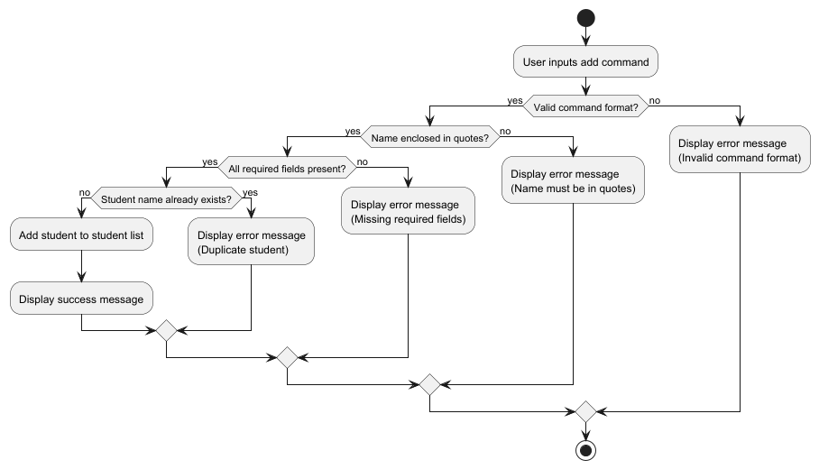

### Edit Student feature

The edit student feature allows TutorTrack to edit a current student to the input value.

#### Implementation

The edit student command mechanism is facilitated by the `EditCommandParser` class which implements the `Parser` interface.
`EditCommandParser#parse()` is exposed in the `Parser` interface as `Parser#parse()`.

`EditCommandParser` implements the following operations:
* `EditCommandParser#parse()` — Parses the input arguments by first extracting the index from the preamble, then handling quoted names (to support names with `s/o` or `d/o`), and finally storing the prefixes and their respective values as an `ArgumentMultimap`. It creates a new `EditCommand` object with the parsed index and an `EditPersonDescriptor` containing the fields to be updated. Names must be enclosed in quotes (e.g., `n/"John Tan"`) to ensure proper parsing. Only the fields provided by the user are modified, while unprovided fields remain unchanged.

The `EditCommand` object then communicates with the `Model` API by calling the `Model#setPerson(Person, Person)` method, which replaces the target student with the edited version in the student list.

The method `EditCommand#execute()` returns a `CommandResult` object, which stores information about the completion of the command.

The following sequence diagram shows what happens when a user inputs the edit command.

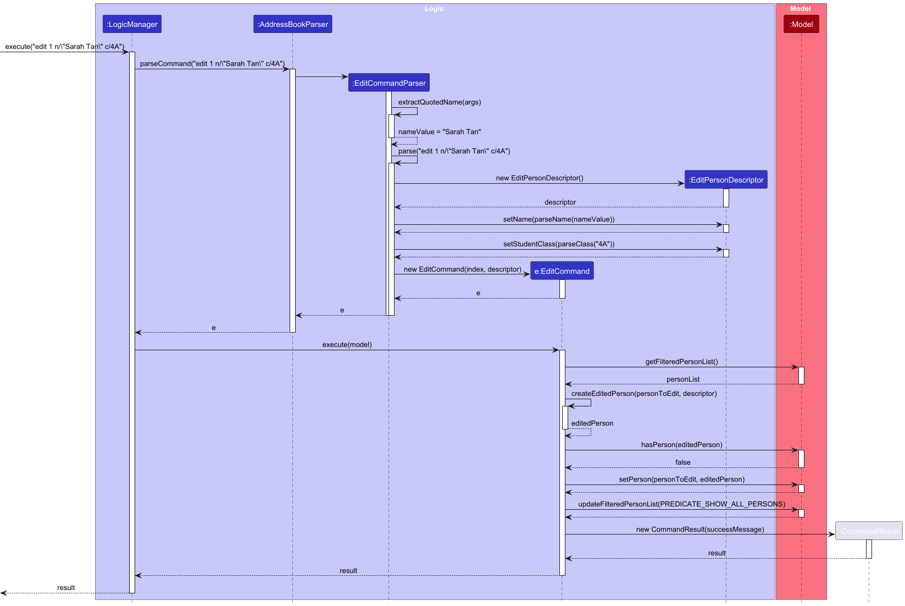

**Example Usage:**

Given below is an example usage scenario and how the edit command behaves at each step.

**Step 1.** The user executes `edit 2 n/"Sarah d/o Ali" c/4A` to edit the name and class of the 2nd student in the displayed list.

**Step 2.** The `EditCommandParser` parses the index `2` from the preamble and extracts the quoted name `"Sarah d/o Ali"`, replacing it with a placeholder to avoid conflicts with the subject prefix `s/`.

**Step 3.** The `ArgumentMultimap` stores the parsed values for the provided prefixes (`n/`, `c/`). Other fields are not present in the map.

**Step 4.** An `EditPersonDescriptor` is created with only the name and class fields set. The descriptor preserves all other existing fields (subjects, emergency contact, payment status, etc.).

**Step 5.** A new `Student` object is constructed by combining the edited fields with the original student's unchanged fields, then replaces the original student via `Model#setPerson(Person, Person)`.

**Step 6.** The `CommandResult` object is returned with a success message displaying the updated student's details.

**Note:** If the user provides a name field without quotes (e.g., `edit 1 n/John Tan`), a `ParseException` is thrown with the message "Name must be enclosed in quotes."

The following activity diagram shows what happens when a user inputs the edit command.

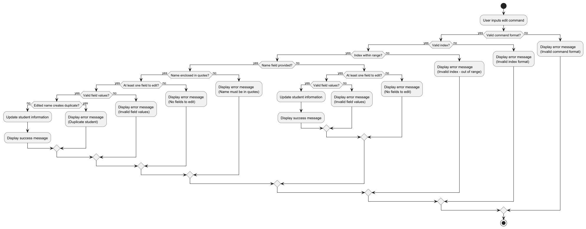

### Delete Student feature

Delete feature allows tutors to delete a student from the list of students.

#### Implementation

The delete student command mechanism is facilitated by the `DeleteCommandParser` class which implements the `Parser` interface.
`DeleteCommandParser#parse()` is exposed in the `Parser` interface as `Parser#parse()`.

`DeleteCommandParser` implements the following operations:
* `DeleteCommandParser#parse()` — Parses the input arguments by extracting and validating the index. The parser ensures the index is a positive integer (greater than 0). If the index is zero, negative, or not a valid number, a `ParseException` is thrown with an appropriate error message. It creates a new `DeleteCommand` object with the parsed index.

The `DeleteCommand` object then communicates with the `Model` API by calling the `Model#deletePerson(Person)` method, which removes the specified student from the student list.

The method `DeleteCommand#execute()` returns a `CommandResult` object, which stores information about the completion of the command.

The following activity diagram shows what happens when a user inputs the delete command.

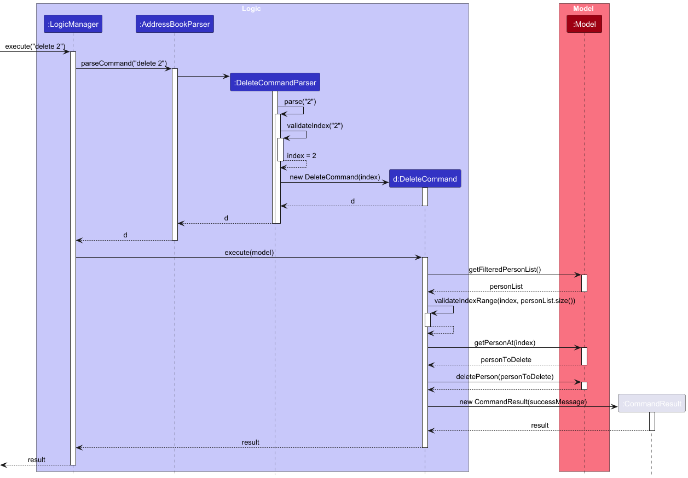

**Example Usage:**

Given below is an example usage scenario and how the delete command behaves at each step.

**Step 1.** The user executes `delete 3` to delete the 3rd student in the displayed list.

**Step 2.** The `DeleteCommandParser` validates that `3` is a valid positive integer and creates an `Index` object from it.

**Step 3.** The `DeleteCommand` retrieves the student at index 3 from the filtered person list in the `Model`.

**Step 4.** The student is removed from the model via `Model#deletePerson(Person)`.

**Step 5.** The `CommandResult` object is returned with a success message displaying the deleted student's details.

**Error Handling:**
* If the user provides `delete 0` or `delete -5`, a `ParseException` is thrown with the message "The person index must be a positive integer."
* If the user provides `delete abc`, a `ParseException` is thrown with the message "The person index provided is invalid."
* If the index is out of range (e.g., `delete 999` when there are only 10 students), a `CommandException` is thrown during execution with the message indicating an invalid person index.

The following activity diagram shows what happens when a user inputs the delete command.

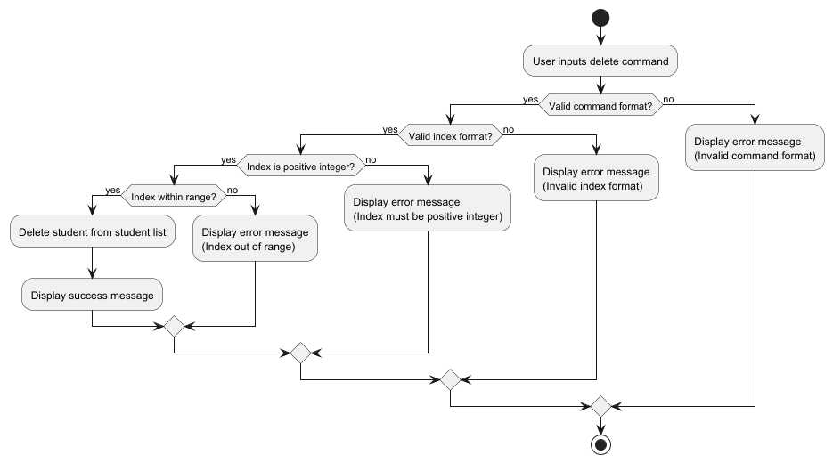

### Archive Student feature

The archive feature allows tutors to archive students to a list archive, allowing for unarchiving in the future.

#### Implementation

The archive student command mechanism is facilitated by the `ArchiveCommandParser` class which implements the `Parser` interface.
`ArchiveCommandParser#parse()` is exposed in the `Parser` interface as `Parser#parse()`.

`ArchiveCommandParser` implements the following operations:
* `ArchiveCommandParser#parse()` — Parses the input arguments by extracting and validating the index using `ParserUtil#parseIndex()`. The parser ensures the index is a positive integer. If the index is invalid (zero, negative, or not a number), a `ParseException` is thrown with the command usage message. It creates a new `ArchiveCommand` object with the parsed index.

The `ArchiveCommand` object then communicates with the `Model` API by calling the `Model#archivePerson(Person)` method, which moves the specified student from the active student list to the archived student list.

The method `ArchiveCommand#execute()` returns a `CommandResult` object, which stores information about the completion of the command.

The following sequence diagram shows what happens when a user inputs the archive command.

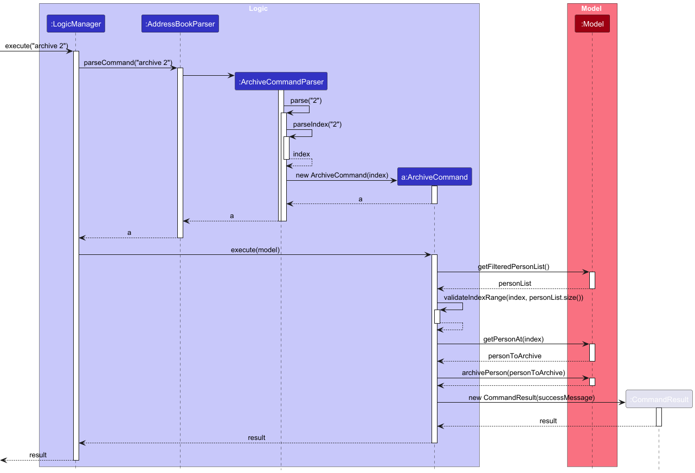

**Example Usage:**

Given below is an example usage scenario and how the archive command behaves at each step.

**Step 1.** The user executes `archive 2` to archive the 2nd student in the displayed list.

**Step 2.** The `ArchiveCommandParser` validates that `2` is a valid positive integer and creates an `Index` object from it.

**Step 3.** The `ArchiveCommand` retrieves the student at index 2 from the filtered person list in the `Model`.

**Step 4.** The student is moved from the active list to the archived list via `Model#archivePerson(Person)`.

**Step 5.** The `CommandResult` object is returned with a success message displaying the archived student's details.

**Note:** Archived students are not deleted and can be viewed using the `listarchive` command or restored using the `unarchive` command. All student details (subjects, attendance, payment status, etc.) are preserved when archiving.

**Error Handling:**
* If the user provides an invalid index format, a `ParseException` is thrown with the command usage message.
* If the index is out of range (e.g., `archive 999` when there are only 10 students), a `CommandException` is thrown during execution with the message indicating an invalid person index.

The following activity diagram shows what happens when a user inputs the archive command.

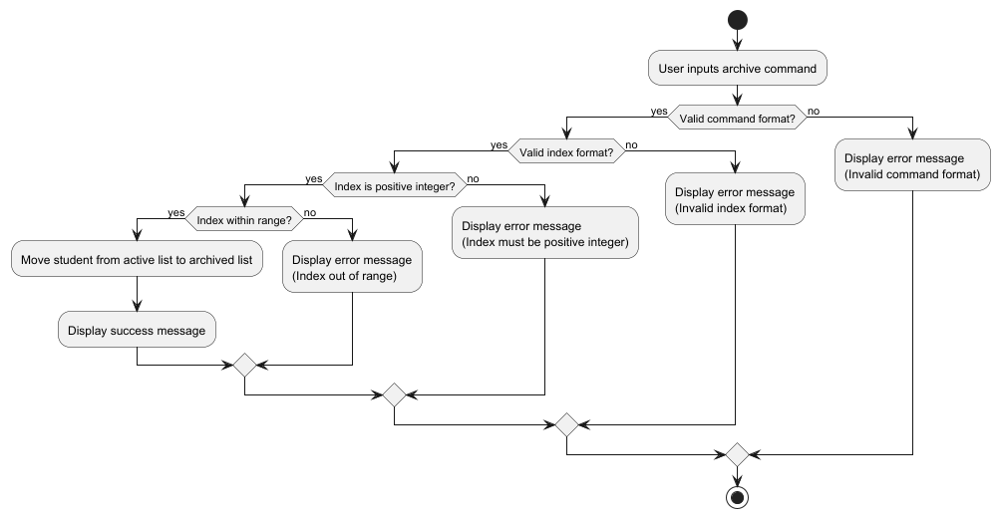

### Unarchive Student feature

The unarchive feature allows tutors to unarchive students from the list of archive students.

#### Implementation

The unarchive student command mechanism is facilitated by the `UnarchiveCommandParser` class which implements the `Parser` interface.
`UnarchiveCommandParser#parse()` is exposed in the `Parser` interface as `Parser#parse()`.

`UnarchiveCommandParser` implements the following operations:
* `UnarchiveCommandParser#parse()` — Parses the input arguments by extracting and validating the index using `ParserUtil#parseIndex()`. The parser ensures the index is a positive integer and logs the parsing process for debugging purposes. If the index is invalid (zero, negative, or not a number), a `ParseException` is thrown with the command usage message. It creates a new `UnarchiveCommand` object with the parsed index.

The `UnarchiveCommand` object then communicates with the `Model` API by calling the `Model#unarchivePerson(Person)` method, which moves the specified student from the archived student list back to the active student list.

The method `UnarchiveCommand#execute()` returns a `CommandResult` object, which stores information about the completion of the command.

The following sequence diagram shows what happens when a user inputs the unarchive command.

**Example Usage:**

Given below is an example usage scenario and how the unarchive command behaves at each step.

**Step 1.** The user first executes `listarchive` to view all archived students.

**Step 2.** The user executes `unarchive 1` to unarchive the 1st student in the archived list.

**Step 3.** The `UnarchiveCommandParser` validates that `1` is a valid positive integer, logs the parsing process, and creates an `Index` object from it.

**Step 4.** The `UnarchiveCommand` retrieves the student at index 1 from the filtered archived person list in the `Model`.

**Step 5.** The student is moved from the archived list back to the active list via `Model#unarchivePerson(Person)`.

**Step 6.** The `CommandResult` object is returned with a success message displaying the unarchived student's details.

**Note:** The index refers to the position in the **archived student list**, not the active student list. Use `listarchive` to view archived students before unarchiving. All student details (subjects, attendance, payment status, etc.) are preserved when unarchiving.

**Error Handling:**
* If the user provides an invalid index format, a `ParseException` is thrown with the command usage message.
* If the index is out of range (e.g., `unarchive 999` when there are only 3 archived students), a `CommandException` is thrown during execution with the message indicating an invalid person index.

The following activity diagram shows what happens when a user inputs the unarchive command.

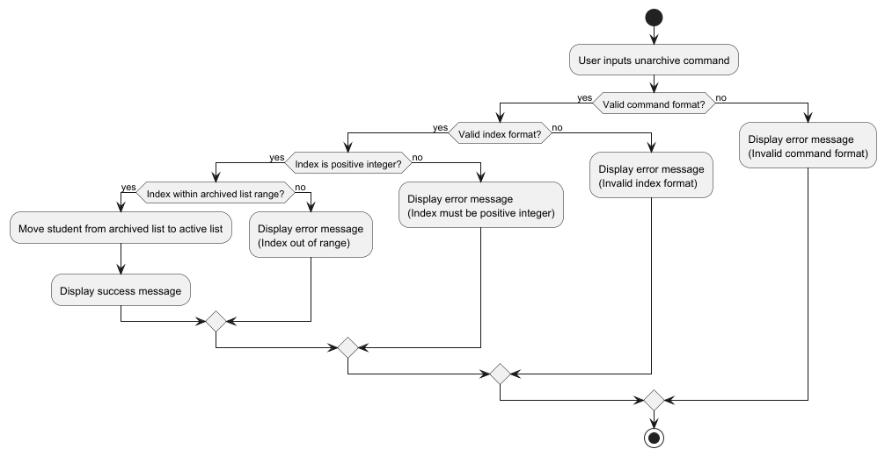

### List Archive feature

The list archive feature allows tutors to list the student archive.

#### Implementation

The list archive command mechanism is facilitated by the `ListArchiveCommandParser` class which implements the `Parser` interface.
`ListArchiveCommandParser#parse()` is exposed in the `Parser` interface as `Parser#parse()`.

`ListArchiveCommandParser` implements the following operations:
* `ListArchiveCommandParser#parse()` — Parses the input arguments by validating that no additional arguments are provided after the `listarchive` command. If any arguments are present, a `ParseException` is thrown with the command usage message. The parser creates a new `ListArchiveCommand` object with no parameters.

The `ListArchiveCommand` object then communicates with the `Model` API by calling the `Model#updateFilteredArchivedPersonList(Predicate)` method with a predicate that shows all archived students, effectively displaying the complete archived student list.

The method `ListArchiveCommand#execute()` returns a `CommandResult` object, which stores information about the completion of the command.

The following sequence diagram shows what happens when a user inputs the listarchive command.

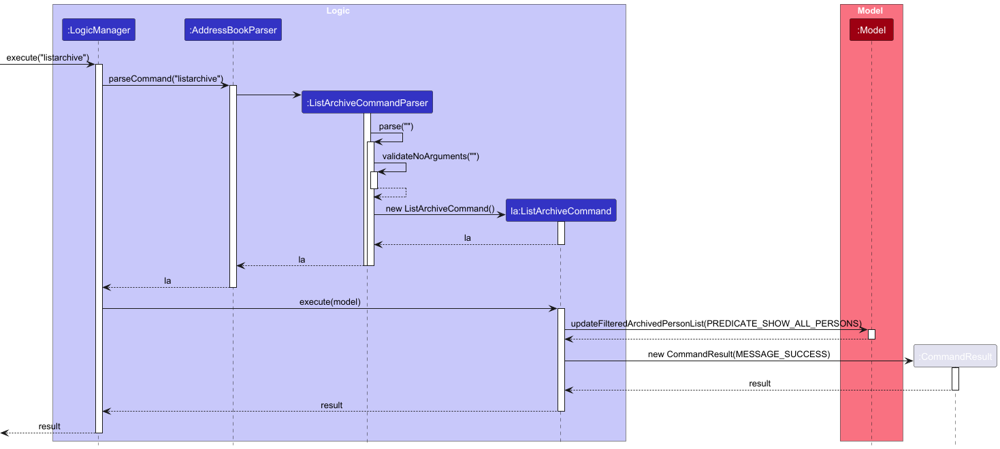

**Example Usage:**

Given below is an example usage scenario and how the list archive command behaves at each step.

**Step 1.** The user wants to view all archived students in the system.

**Step 2.** The user executes `listarchive` to display the archived student list.

**Step 3.** The `ListArchiveCommandParser` validates that no additional arguments were provided (the trimmed input is empty).

**Step 4.** The `ListArchiveCommand` updates the filtered archived person list via `Model#updateFilteredArchivedPersonList(PREDICATE_SHOW_ALL_PERSONS)`, which displays all archived students.

**Step 5.** The `CommandResult` object is returned with a success message "Listed all archived persons".

**Note:** The `listarchive` command only shows archived students. Archived students retain all their details (class, subjects, attendance, payment status, etc.) for recordkeeping purposes. To move a student back to the active list, use the `unarchive` command.

**Error Handling:**
* If the user provides any arguments (e.g., `listarchive 123` or `listarchive extra`), a `ParseException` is thrown with the command usage message indicating that the listarchive command takes no parameters.

The following activity diagram shows what happens when a user inputs the listarchive command.

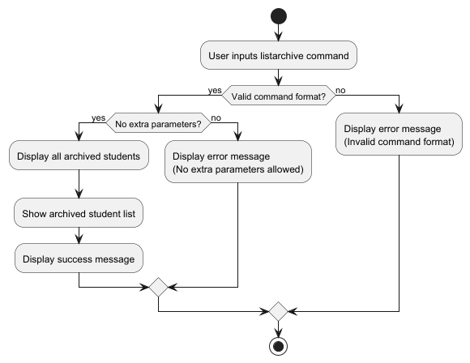

### Find Student feature

The find feature allows tutors to find students by the student's name.

#### Implementation

The find student command mechanism is facilitated by the `FindCommandParser` class which implements the `Parser` interface.
`FindCommandParser#parse()` is exposed in the `Parser` interface as `Parser#parse()`.

`FindCommandParser` implements the following operations:
* `FindCommandParser#parse()` — Parses the input arguments by trimming whitespace and splitting the input into individual keywords using whitespace as the delimiter. If the input is empty after trimming, a `ParseException` is thrown. The parser creates a `NameContainsKeywordsPredicate` with the list of keywords, which is then used to construct a new `FindCommand` object.

The `FindCommand` object then communicates with the `Model` API by calling the `Model#updateFilteredPersonList(Predicate)` method, which filters the student list to show only students whose names contain any of the specified keywords (case-insensitive matching).

The method `FindCommand#execute()` returns a `CommandResult` object, which stores information about the completion of the command and the number of students found.

The following sequence diagram shows what happens when a user inputs the find command.

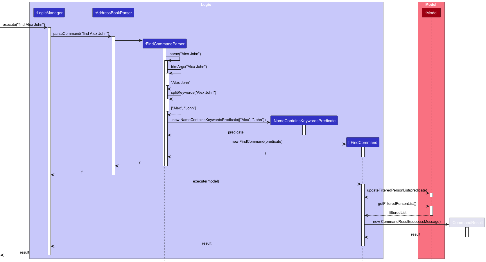

**Example Usage:**

Given below is an example usage scenario and how the find command behaves at each step.

**Step 1.** The user executes `find Alex John` to find all students whose names contain either "Alex" or "John".

**Step 2.** The `FindCommandParser` trims the input and splits it into keywords: `["Alex", "John"]`.

**Step 3.** A `NameContainsKeywordsPredicate` is created with these keywords, which will match any student whose name contains at least one of the keywords (case-insensitive).

**Step 4.** The `FindCommand` updates the filtered person list via `Model#updateFilteredPersonList(Predicate)`, filtering to show only matching students.

**Step 5.** The `CommandResult` object is returned with a message indicating the number of students found (e.g., "2 persons listed!").

**Note:** The find command performs case-insensitive partial matching. For example, `find alex` will match students named "Alex Yeoh", "Alexander", and "Alexandra". Multiple keywords are treated with OR logic - a student matches if their name contains any of the provided keywords.

**Error Handling:**
* If the user provides `find` with no keywords (e.g., just `find` or `find   `), a `ParseException` is thrown with the command usage message.

The following activity diagram shows what happens when a user inputs the find command.

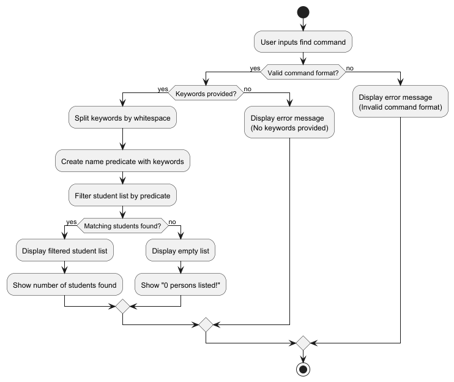

### Add Lesson feature

The add lesson feature allows tutor to add lessons to a subject.

#### Implementation

The add lesson command mechanism is facilitated by the `AddLessonCommandParser` class which implements the `Parser` interface.
`AddLessonCommandParser#parse()` is exposed in the `Parser` interface as `Parser#parse()`.

`AddLessonCommandParser` implements the following operations:
* `AddLessonCommandParser#parse()` — Parses the input arguments by tokenizing them into an `ArgumentMultimap` with the subject prefix (`s/`) and lesson name prefix (`n/`). The parser validates that both prefixes are present, that no preamble exists, and that exactly one value is provided for each prefix. If the subject or lesson name is empty after trimming, a `ParseException` is thrown. The parser creates a new `Lesson` object with the parsed lesson name and subject, which is then used to construct a new `AddLessonCommand` object.

The `AddLessonCommand` object then communicates with the `Model` API by calling the `Model#addLesson(Lesson)` method, which adds the newly-constructed lesson to the lesson list. The lesson list is automatically persisted to storage after the command executes.

The method `AddLessonCommand#execute()` returns a `CommandResult` object, which stores information about the completion of the command.

The following sequence diagram shows what happens when a user inputs the add lesson command.

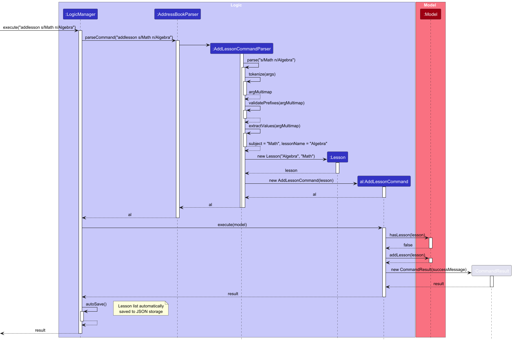

**Example Usage:**

Given below is an example usage scenario and how the add lesson command behaves at each step.

**Step 1.** The user executes `addlesson s/Math n/Algebra` to add a new lesson named "Algebra" under the "Math" subject.

**Step 2.** The `AddLessonCommandParser` tokenizes the arguments and validates that both `s/` and `n/` prefixes are present with exactly one value each.

**Step 3.** The parser trims the subject value ("Math") and lesson name value ("Algebra") to remove any extra whitespace.

**Step 4.** A new `Lesson` object is created with the lesson name "Algebra" and subject "Math".

**Step 5.** The `AddLessonCommand` checks if the lesson already exists using `Model#hasLesson(Lesson)`. If it's a duplicate, a `CommandException` is thrown.

**Step 6.** The lesson is added to the model via `Model#addLesson(Lesson)`, and the lesson list is automatically saved to the JSON storage file.

**Step 7.** The `CommandResult` object is returned with a success message displaying the added lesson's name and subject.

**Error Handling:**
* If the user provides missing prefixes (e.g., `addlesson s/Math`), a `ParseException` is thrown with the command usage message.
* If the user provides multiple values for a prefix (e.g., `addlesson s/Math s/Science n/Algebra`), a `ParseException` is thrown with the message "Only one subject and lesson is allowed."
* If the subject or lesson name is empty (e.g., `addlesson s/ n/Algebra`), a `ParseException` is thrown with the lesson constraints message.
* If the lesson already exists in the system, a `CommandException` is thrown with the message "This lesson already exists in this subject."

The following activity diagram shows what happens when a user inputs the add lesson command.

### Delete Lesson feature

The delete lesson feature allows tutors to delete lessons from a certain subject.

#### Implementation

The delete lesson command mechanism is facilitated by the `DeleteLessonCommandParser` class which implements the `Parser` interface.
`DeleteLessonCommandParser#parse()` is exposed in the `Parser` interface as `Parser#parse()`.

`DeleteLessonCommandParser` implements the following operations:
* `DeleteLessonCommandParser#parse()` — Parses the input arguments by tokenizing them into an `ArgumentMultimap` with two required prefixes: subject (`s/`) and lesson name (`n/`). The parser validates that both prefixes are present, that no preamble exists, and that exactly one value is provided for each prefix. It extracts and trims the subject and lesson name values, ensuring neither is empty. The parser creates a `Lesson` object with the parsed values, which is then used to construct a new `DeleteLessonCommand` object.

The `DeleteLessonCommand` object then communicates with the `Model` API by calling the `Model#deleteLesson(Lesson)` method, which removes the specified lesson from the lesson list. The lesson list is automatically persisted to storage after the command executes.

The method `DeleteLessonCommand#execute()` returns a `CommandResult` object, which stores information about the completion of the command with a success message displaying the deleted lesson's details.

The following sequence diagram shows what happens when a user inputs the delete lesson command.

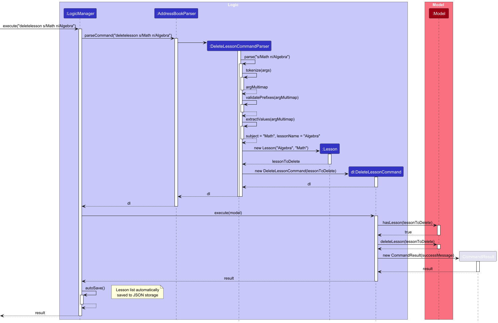

**Example Usage:**

Given below is an example usage scenario and how the delete lesson command behaves at each step.

**Step 1.** The user executes `deletelesson s/Math n/Algebra` to delete the "Algebra" lesson from the "Math" subject.

**Step 2.** The `DeleteLessonCommandParser` tokenizes the arguments and validates that both required prefixes (`s/`, `n/`) are present with exactly one value each.

**Step 3.** The parser extracts and trims each value:
- Subject: "Math"
- Lesson name: "Algebra"

**Step 4.** The parser validates that neither value is empty.

**Step 5.** A `Lesson` object is created with the lesson name "Algebra" and subject "Math".

**Step 6.** The `DeleteLessonCommand` checks if the lesson exists using `Model#hasLesson(Lesson)`. If the lesson doesn't exist, a `CommandException` is thrown.

**Step 7.** The lesson is removed from the model via `Model#deleteLesson(Lesson)`, and the changes are automatically saved to the JSON storage file.

**Step 8.** The `CommandResult` object is returned with a success message displaying the deleted lesson's name and subject.

**Note:** Deleting a lesson from the lesson list does not affect individual student attendance records. Students who have attendance marked for this lesson will retain those records in their attendance history.

**Error Handling:**
* If either the subject or lesson name prefix is missing, a `ParseException` is thrown with the command usage message.
* If multiple values are provided for a prefix (e.g., `deletelesson s/Math s/Science n/Algebra`), a `ParseException` is thrown with the message "Only one subject and one lesson name are allowed."
* If the subject or lesson name is empty after trimming (e.g., `deletelesson s/ n/Algebra`), a `ParseException` is thrown with the command usage message.
* If a preamble is present (e.g., `deletelesson extra s/Math n/Algebra`), a `ParseException` is thrown with the command usage message.
* If the specified lesson doesn't exist in the system, a `CommandException` is thrown indicating the lesson was not found.

The following activity diagram shows what happens when a user inputs the delete lesson command.

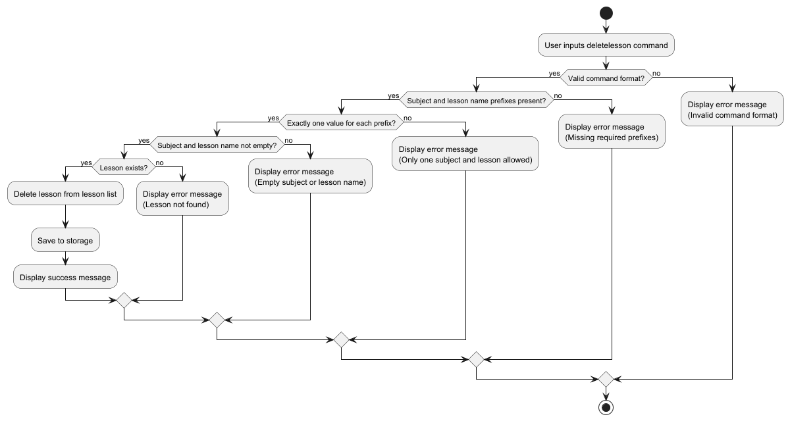

### List Student feature

The list feature allows tutor to list the current students.

#### Implementation

The list student command mechanism is facilitated by the `ListCommandParser` class which implements the `Parser` interface.
`ListCommandParser#parse()` is exposed in the `Parser` interface as `Parser#parse()`.

`ListCommandParser` implements the following operations:
* `ListCommandParser#parse()` — Parses the input arguments by validating that no additional arguments are provided after the `list` command. If any arguments are present, a `ParseException` is thrown with the command usage message. The parser creates a new `ListCommand` object with no parameters.

The `ListCommand` object then communicates with the `Model` API by calling the `Model#updateFilteredPersonList(Predicate)` method with a predicate that shows all students, effectively resetting any active filters from previous `find` commands.

The method `ListCommand#execute()` returns a `CommandResult` object, which stores information about the completion of the command.

The following sequence diagram shows what happens when a user inputs the list command.

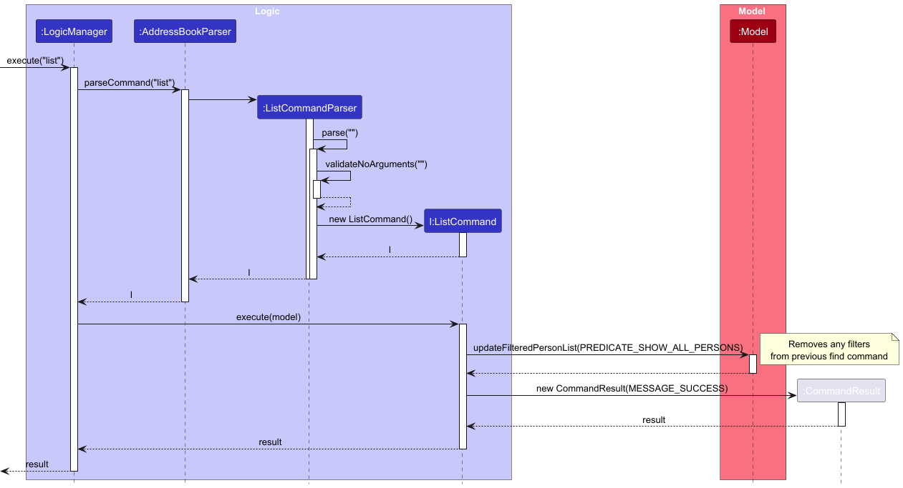

**Example Usage:**

Given below is an example usage scenario and how the list command behaves at each step.

**Step 1.** The user previously executed `find Alex` which filtered the displayed student list.

**Step 2.** The user executes `list` to view all students again.

**Step 3.** The `ListCommandParser` validates that no additional arguments were provided (the trimmed input is empty).

**Step 4.** The `ListCommand` updates the filtered person list via `Model#updateFilteredPersonList(PREDICATE_SHOW_ALL_PERSONS)`, which removes all filters and displays all active students.

**Step 5.** The `CommandResult` object is returned with a success message "Listed all persons".

**Note:** The `list` command only shows active (non-archived) students. To view archived students, use the `listarchive` command instead.

**Error Handling:**
* If the user provides any arguments (e.g., `list 123` or `list extra`), a `ParseException` is thrown with the command usage message indicating that the list command takes no parameters.

The following activity diagram shows what happens when a user inputs the list command.

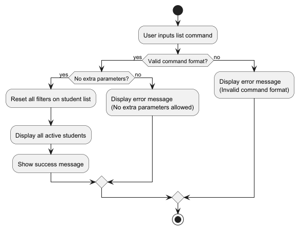

### List Lesson feature

The list lesson feature allows tutors to list all the lessons for a certain subject.

##### Implementation

The list lessons command mechanism is facilitated by the `ListLessonsCommandParser` class which implements the `Parser` interface.
`ListLessonsCommandParser#parse()` is exposed in the `Parser` interface as `Parser#parse()`.

`ListLessonsCommandParser` implements the following operations:
* `ListLessonsCommandParser#parse()` — Parses the input arguments by tokenizing them into an `ArgumentMultimap` with the subject prefix (`s/`). The parser validates that the subject prefix is present, that no preamble exists, and that the subject value is not empty after trimming. If any validation fails, a `ParseException` is thrown with the command usage message. The parser creates a new `ListLessonsCommand` object with the parsed subject name.

The `ListLessonsCommand` object then communicates with the `Model` API by calling the `Model#updateFilteredLessonList(Predicate)` method with a predicate that filters lessons by the specified subject, displaying only lessons that belong to that subject.

The method `ListLessonsCommand#execute()` returns a `CommandResult` object, which stores information about the completion of the command and the number of lessons found for the subject.

**Example Usage:**

Given below is an example usage scenario and how the list lessons command behaves at each step.

**Step 1.** The user executes `listlessons s/Math` to view all lessons under the "Math" subject.

**Step 2.** The `ListLessonsCommandParser` tokenizes the arguments and validates that the `s/` prefix is present with a non-empty value.

**Step 3.** The subject value "Math" is extracted and trimmed to remove any extra whitespace.

**Step 4.** A new `ListLessonsCommand` is created with the subject name "Math".

**Step 5.** The `ListLessonsCommand` checks if the subject exists in the system using `Model#hasSubject(String)`. If the subject doesn't exist, a `CommandException` is thrown.

**Step 6.** The filtered lesson list is updated via `Model#updateFilteredLessonList(Predicate)` to show only lessons belonging to "Math".

**Step 7.** The `CommandResult` object is returned with a message indicating the number of lessons found for the specified subject.

**Note:** The list lessons command is case-insensitive. For example, `listlessons s/math` will match lessons with the subject "Math", "MATH", or "math".

The following sequence diagram shows what happens when a user inputs the listlessons command.

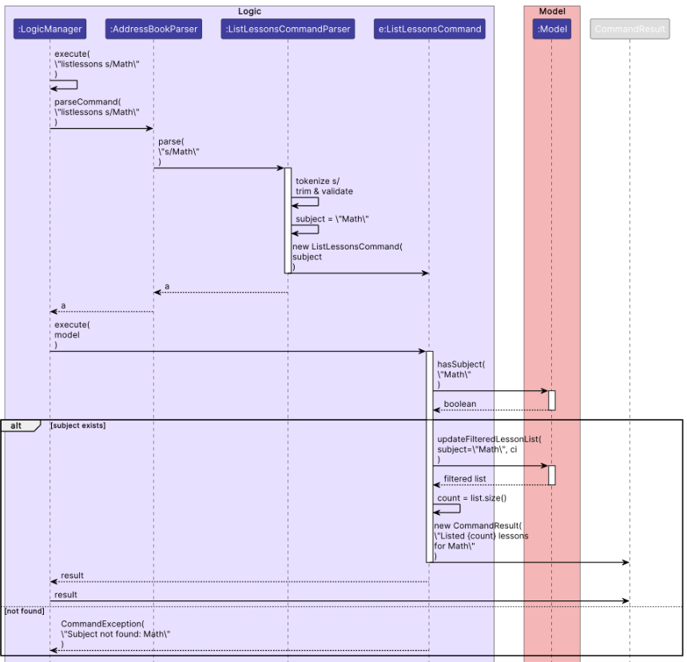

**Error Handling:**
* If the user provides no subject prefix (e.g., `listlessons`), a `ParseException` is thrown with the command usage message.
* If the subject value is empty (e.g., `listlessons s/`), a `ParseException` is thrown with the command usage message.
* If the user provides a preamble (e.g., `listlessons extra s/Math`), a `ParseException` is thrown with the command usage message.
* If the specified subject does not exist in the system, a `CommandException` is thrown with the message "Subject not found: [subject name]".

The following activity diagram shows what happens when a user inputs the listlessons command.

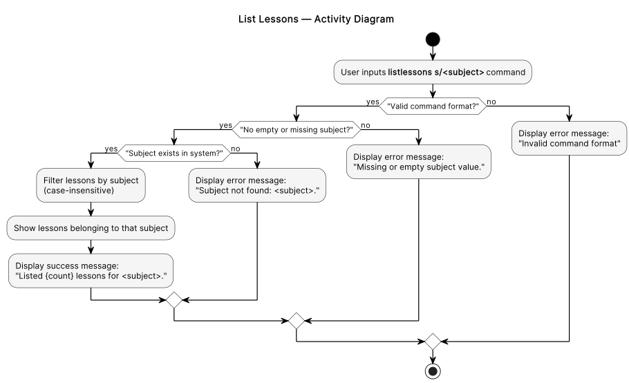

### Mark Student Attendance feature

The mark attendance feature allows for tutor to mark the student's attendance for a certain lesson.

#### Implementation

The mark attendance command mechanism is facilitated by the `MarkAttendanceCommandParser` class which implements the `Parser` interface.
`MarkAttendanceCommandParser#parse()` is exposed in the `Parser` interface as `Parser#parse()`.

`MarkAttendanceCommandParser` implements the following operations:
* `MarkAttendanceCommandParser#parse()` — Parses the input arguments by tokenizing them into an `ArgumentMultimap` with four required prefixes: name (`n/`), subject (`s/`), lesson (`l/`), and status (`st/`). The parser validates that all four prefixes are present, that no preamble exists, and that there are no duplicate prefixes. It extracts and trims each value, creates a `Name` object, a `Subject` object, a `Lesson` object, and converts the status string to an `AttendanceStatus` enum (case-insensitive). If the status is invalid, a `ParseException` is thrown. The parser creates a new `MarkAttendanceCommand` object with the parsed values.

The following sequence diagram shows what happens when a user inputs the markattendance command.

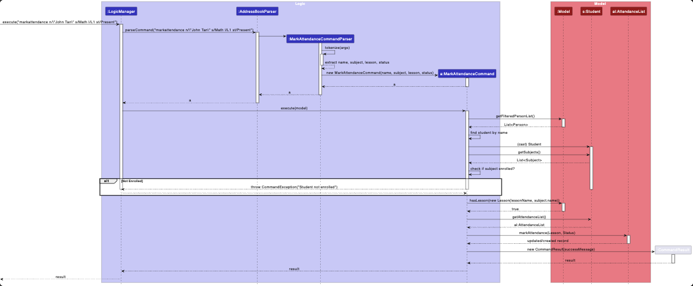

The `MarkAttendanceCommand` object then communicates with the `Model` API by:
1. Finding the student by name using `Model#getFilteredPersonList()`
2. Accessing the student's `AttendanceList`
3. Marking the attendance for the specified lesson via `AttendanceList#markAttendance(Lesson, AttendanceStatus)`
4. Updating the student in the model to persist the changes

The method `MarkAttendanceCommand#execute()` returns a `CommandResult` object, which stores information about the completion of the command with a success message showing the student name, subject, lesson, and attendance status.

**Example Usage:**

Given below is an example usage scenario and how the mark attendance command behaves at each step.

**Step 1.** The user executes `markattendance n/"John Tan" s/Math l/Algebra st/Present` to mark John Tan as present for the Algebra lesson in Math.

**Step 2.** The `MarkAttendanceCommandParser` tokenizes the arguments and validates that all required prefixes (`n/`, `s/`, `l/`, `st/`) are present with no duplicates.

**Step 3.** The parser extracts and trims each value:
- Name: "John Tan"
- Subject: "Math"
- Lesson: "Algebra"
- Status: "PRESENT" (converted to uppercase)

**Step 4.** A `Name` object, `Subject` object, and `Lesson` object are created. The status string "PRESENT" is converted to the `AttendanceStatus.PRESENT` enum value.

**Step 5.** The `MarkAttendanceCommand` searches for the student named "John Tan" in the filtered person list. If not found, a `CommandException` is thrown.

**Step 6.** The command verifies that the student is enrolled in the Math subject and that the Algebra lesson exists. If either check fails, a `CommandException` is thrown.

**Step 7.** The attendance is marked via the student's `AttendanceList#markAttendance(Lesson, AttendanceStatus)` method.

**Step 8.** The updated student is persisted in the model, and the changes are automatically saved to storage.

**Step 9.** The `CommandResult` object is returned with a success message: "Marked attendance for John Tan for Math Algebra → PRESENT".

**Note:** Valid attendance statuses are: PRESENT, ABSENT, EXCUSED (case-insensitive). Names with `s/o` or `d/o` must be enclosed in quotes.

**Error Handling:**
* If any required prefix is missing, a `ParseException` is thrown with the command usage message.
* If duplicate prefixes are provided, a `ParseException` is thrown indicating duplicate prefixes.
* If an invalid status is provided (e.g., `st/Maybe`), a `ParseException` is thrown with the message "Invalid attendance status".
* If the student is not found, a `CommandException` is thrown with the message "Person not found".
* If the subject or lesson doesn't exist for the student, a `CommandException` is thrown with an appropriate error message.

The following activity diagram shows what happens when a user inputs the markattendance command.

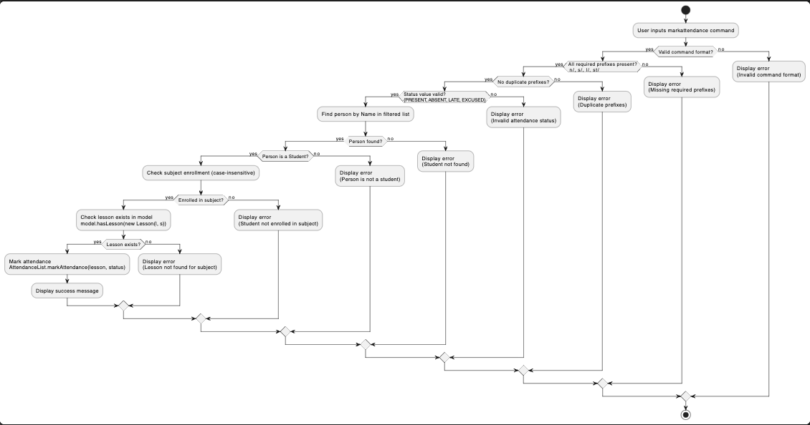

### List Student Attendance feature

The list attendance feature allows tutors to list all the student's attendance for a certain lesson.

#### Implementation

The list attendance command mechanism is facilitated by the `ListAttendanceCommandParser` class which implements the `Parser` interface.
`ListAttendanceCommandParser#parse()` is exposed in the `Parser` interface as `Parser#parse()`.

`ListAttendanceCommandParser` implements the following operations:
* `ListAttendanceCommandParser#parse()` — Parses the input arguments by tokenizing them into an `ArgumentMultimap` with two required prefixes: name (`n/`) and subject (`s/`). The parser validates that both prefixes are present, that no preamble exists, and that there are no duplicate prefixes. It extracts and trims each value, ensuring neither the name nor subject is empty after trimming. The parser creates a `Name` object and a `Subject` object, which are then used to construct a new `ListAttendanceCommand` object.

The `ListAttendanceCommand` object then communicates with the `Model` API by:
1. Finding the student by name using `Model#getFilteredPersonList()`
2. Verifying the student is enrolled in the specified subject
3. Retrieving the student's attendance records for all lessons in that subject via `AttendanceList#getAttendanceForSubject(Subject)`
4. Formatting the attendance data for display

The method `ListAttendanceCommand#execute()` returns a `CommandResult` object, which stores information about the completion of the command with the formatted attendance records for the specified student and subject.

The following sequence diagram shows what happens when a user inputs the listattendance command.

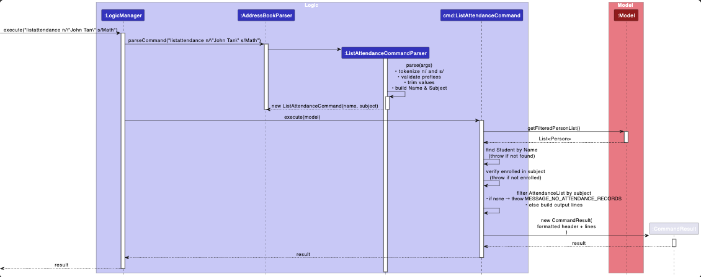

**Example Usage:**

Given below is an example usage scenario and how the list attendance command behaves at each step.

**Step 1.** The user executes `listattendance n/"John Tan" s/Math` to view John Tan's attendance records for all Math lessons.

**Step 2.** The `ListAttendanceCommandParser` tokenizes the arguments and validates that both required prefixes (`n/`, `s/`) are present with no duplicates.

**Step 3.** The parser extracts and trims each value:
- Name: "John Tan"
- Subject: "Math"

**Step 4.** The parser validates that neither value is empty and creates a `Name` object and a `Subject` object.

**Step 5.** The `ListAttendanceCommand` searches for the student named "John Tan" in the filtered person list. If not found, a `CommandException` is thrown.

**Step 6.** The command verifies that the student is enrolled in the Math subject. If not, a `CommandException` is thrown.

**Step 7.** The attendance records for all Math lessons are retrieved from the student's `AttendanceList`.

**Step 8.** The attendance data is formatted showing each lesson name and its corresponding attendance status (e.g., "Algebra: PRESENT", "Calculus: ABSENT").

**Step 9.** The `CommandResult` object is returned with the formatted attendance information displayed to the user.

**Note:** Names with `s/o` or `d/o` must be enclosed in quotes (e.g., `n/"Rohit s/o Kumar"`). The command displays attendance for all lessons within the specified subject.

**Error Handling:**
* If either the name or subject prefix is missing, a `ParseException` is thrown with the command usage message.
* If duplicate prefixes are provided, a `ParseException` is thrown indicating duplicate prefixes.
* If the name or subject value is empty after trimming (e.g., `n/ s/Math`), a `ParseException` is thrown with the command usage message.
* If the student is not found, a `CommandException` is thrown with the message "Person not found".
* If the student is not enrolled in the specified subject, a `CommandException` is thrown indicating the subject was not found for that student.
* If there are no lessons recorded for the subject, an appropriate message is displayed.

The following activity diagram shows what happens when a user inputs the listattendance command.

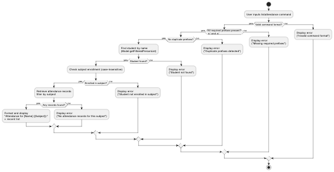

### Clear current Student feature

The clear current student feature allows tutors to delete the list of students in the active student list.

#### Implementation

The clear current students command mechanism is facilitated by the `ClearCommand` class which extends the `Command` class.

`ClearCommand` implements the following operations:
* `ClearCommand#execute(Model)` — Validates that no extra arguments are provided after the `clearcurrent` command. If any arguments are present, a `CommandException` is thrown. The command then clears all current (non-archived) students, lessons, and subjects from the model by calling `Model#clearCurrentStudents()`, `Model#clearLessons()`, and `Model#clearSubjects()`. Archived students are not affected by this operation.

The `ClearCommand` object communicates with the `Model` API by calling:
1. `Model#clearCurrentStudents()` — Removes all students from the active student list
2. `Model#clearLessons()` — Removes all lessons from the lesson list
3. `Model#clearSubjects()` — Removes all subjects from the subject list

The method `ClearCommand#execute()` returns a `CommandResult` object with a success message indicating that current students, lessons, and subjects have been cleared.

**Example Usage:**

Given below is an example usage scenario and how the clear current students command behaves at each step.

**Step 1.** The user wants to clear all current students, lessons, and subjects from TutorTrack while preserving archived students.

**Step 2.** The user executes `clearcurrent` to clear the current data.

**Step 3.** The `ClearCommand` validates that no additional arguments were provided (the trimmed input is empty). If extra parameters are present, a `CommandException` is thrown.

**Step 4.** The `ClearCommand` clears all current students from the active list via `Model#clearCurrentStudents()`.

**Step 5.** All lessons are removed from the lesson list via `Model#clearLessons()`.

**Step 6.** All subjects are removed from the subject list via `Model#clearSubjects()`.

**Step 7.** The changes are automatically persisted to storage.

**Step 8.** The `CommandResult` object is returned with the success message "Current students, lessons and subjects have been cleared!".

**Note:** This command only clears the **active (non-archived) student list**, along with all lessons and subjects. Archived students remain untouched and can be viewed with the `listarchive` command. This operation cannot be undone, so use with caution.

The following sequence diagram shows what happens when a user inputs the clearcurrent command.

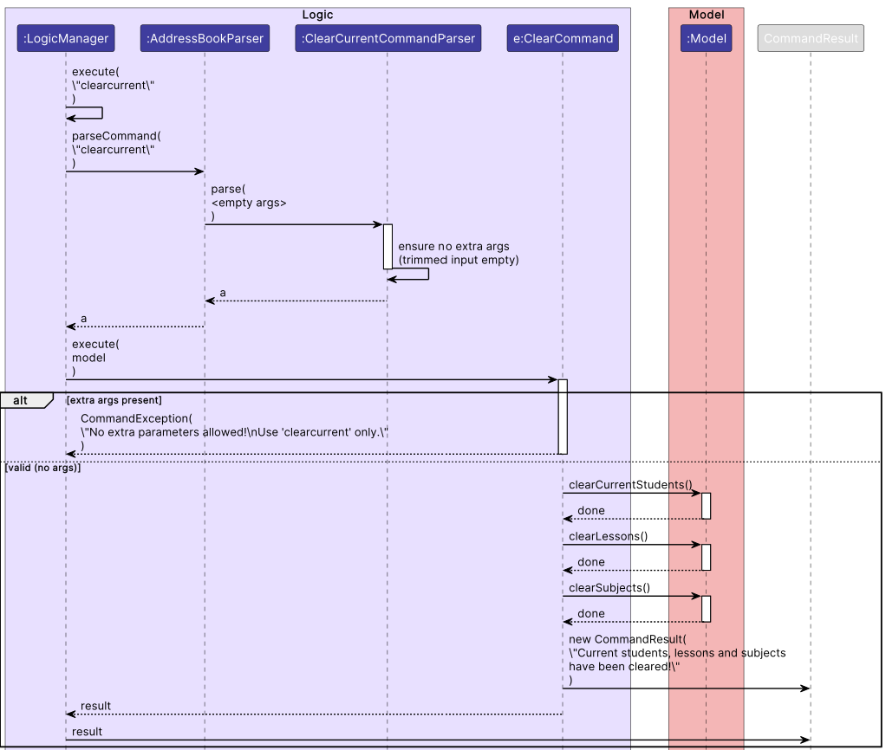

**Error Handling:**
* If the user provides any arguments (e.g., `clearcurrent 123` or `clearcurrent extra`), a `CommandException` is thrown with the message "No extra parameters allowed! Use 'clearcurrent' only."

The following activity diagram shows what happens when a user inputs the clearcurrent command.

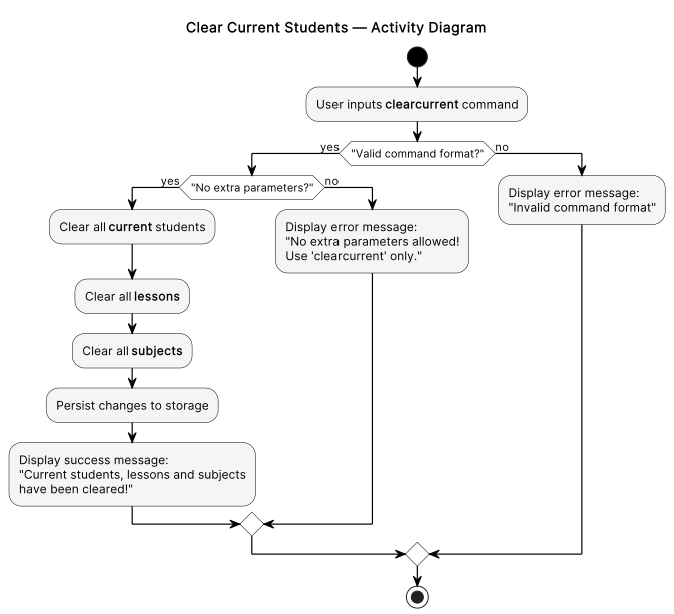

### Clear archived Student feature

The clear archived student feature allows tutors to delete the archived list of students.

#### Implementation

The clear archive command mechanism is facilitated by the `ClearArchiveCommand` class which extends the `Command` class.

`ClearArchiveCommand` implements the following operations:
* `ClearArchiveCommand#execute(Model)` — Validates that no extra arguments are provided after the `cleararchive` command. If any arguments are present, a `CommandException` is thrown. The command then clears all archived students from the model by calling `Model#clearArchivedStudents()`. Current (active) students, lessons, and subjects are not affected by this operation.

The `ClearArchiveCommand` object communicates with the `Model` API by calling:
* `Model#clearArchivedStudents()` — Removes all students from the archived student list

The method `ClearArchiveCommand#execute()` returns a `CommandResult` object with a success message indicating that archived students have been cleared.

**Example Usage:**

Given below is an example usage scenario and how the clear archive command behaves at each step.

**Step 1.** The user wants to permanently clear all archived students from TutorTrack while keeping current students intact.

**Step 2.** The user executes `cleararchive` to clear the archived student list.

**Step 3.** The `ClearArchiveCommand` validates that no additional arguments were provided (the trimmed input is empty). If extra parameters are present, a `CommandException` is thrown.

**Step 4.** The `ClearArchiveCommand` clears all archived students from the archived list via `Model#clearArchivedStudents()`.

**Step 5.** The changes are automatically persisted to storage.

**Step 6.** The `CommandResult` object is returned with the success message "Archived students have been cleared!".

**Note:** This command only clears the **archived student list**. Current (active) students, lessons, and subjects remain untouched. This operation cannot be undone, so use with caution. Once archived students are cleared, their data cannot be recovered.

The following sequence diagram shows what happens when a user inputs the cleararchive command.

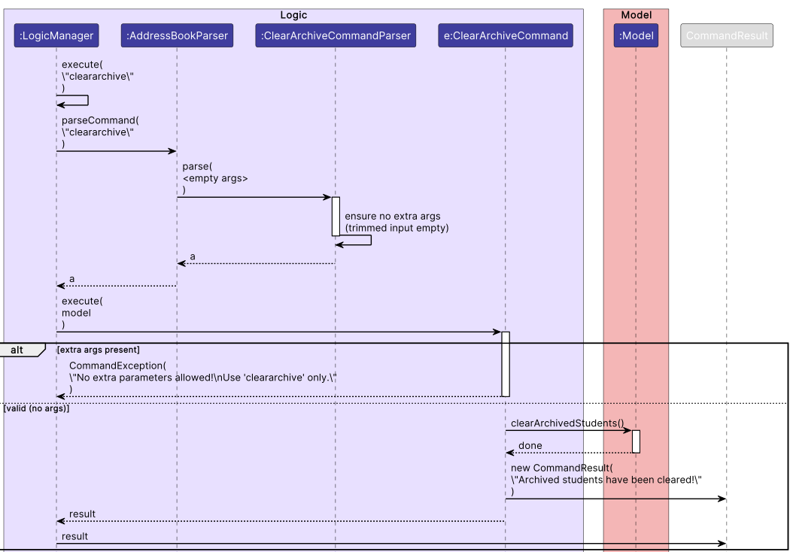

**Error Handling:**
* If the user provides any arguments (e.g., `cleararchive 123` or `cleararchive extra`), a `CommandException` is thrown with the message "No extra parameters allowed! Use 'cleararchive' only."

The following activity diagram shows what happens when a user inputs the cleararchive command.

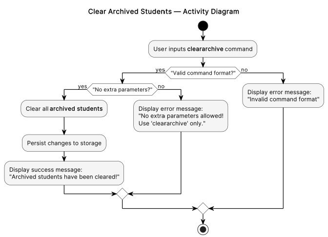

### Help feature

The help feature allows tutors to see the User Guide to aid them in the usage of the app.

##### Implementation

#### Help Command

The help command mechanism is facilitated by the `HelpCommand` class which extends the `Command` class.

`HelpCommand` implements the following operations:
* `HelpCommand#execute(Model)` — Validates that no extra arguments are provided after the `help` command. If any arguments are present, a `CommandException` is thrown. The command returns a `CommandResult` with a special flag that triggers the UI to display the help window showing program usage instructions for all available commands.

The `HelpCommand` object does not interact with the `Model` API directly, as it only affects the UI layer by signaling the application to open the help window.

The method `HelpCommand#execute()` returns a `CommandResult` object with:
* A success message "Opened help window."
* A `showHelp` flag set to `true` to trigger the help window display
* An `exit` flag set to `false`

The following sequence diagram shows what happens when a user inputs the help command.

**Example Usage:**

Given below is an example usage scenario and how the help command behaves at each step.

**Step 1.** The user wants to view the program usage instructions and command reference.

**Step 2.** The user executes `help` to open the help window.

**Step 3.** The `HelpCommand` validates that no additional arguments were provided (the trimmed input is empty). If extra parameters are present, a `CommandException` is thrown.

**Step 4.** A `CommandResult` is created with the `showHelp` flag set to `true`.

**Step 5.** The UI component detects the `showHelp` flag and opens a new help window displaying comprehensive usage instructions for all TutorTrack commands.

**Step 6.** The success message "Opened help window." is displayed in the result display area.

**Note:** The help window contains:
* Link to the full user guide

### Exit feature

The exit feature allows users to exit the app.

#### Implementation

The exit command mechanism is facilitated by the `ExitCommand` class which extends the `Command` class.

`ExitCommand` implements the following operations:
* `ExitCommand#execute(Model)` — Validates that no extra arguments are provided after the `exit` command. If any arguments are present, a `CommandException` is thrown. The command returns a `CommandResult` with a special flag that triggers the application to terminate gracefully, saving all data before closing.

The `ExitCommand` object does not interact with the `Model` API directly, as it only signals the application layer to initiate the shutdown sequence.

The method `ExitCommand#execute()` returns a `CommandResult` object with:
* A success message "Exiting Tutor Track as requested ..."
* A `showHelp` flag set to `false`
* An `exit` flag set to `true` to trigger application termination

The following sequence diagram shows what happens when a user inputs the exit command.

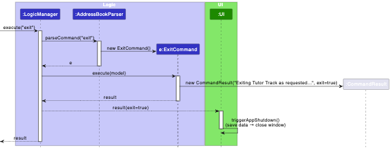

**Example Usage:**

Given below is an example usage scenario and how the exit command behaves at each step.

**Step 1.** The user wants to close the TutorTrack application.

**Step 2.** The user executes `exit` to terminate the program.

**Step 3.** The `ExitCommand` validates that no additional arguments were provided (the trimmed input is empty). If extra parameters are present, a `CommandException` is thrown.

**Step 4.** A `CommandResult` is created with the `exit` flag set to `true`.

**Step 5.** The UI component detects the `exit` flag and initiates the application shutdown sequence.

**Step 6.** The success message "Exiting Tutor Track as requested ..." is displayed briefly in the result display area.

**Step 7.** The application saves all current data (students, archived students, lessons, subjects) to storage.

**Step 8.** The application window closes and the program terminates.

**Note:** The exit command ensures that all data is properly saved before the application closes. Any unsaved changes are automatically persisted to the JSON storage file during the shutdown sequence.

**Error Handling:**
* If the user provides any arguments (e.g., `exit now` or `exit 123`), a `CommandException` is thrown with the message "No extra parameters allowed! Use 'exit' only."
**Error Handling:**
* If the user provides any arguments (e.g., `help list` or `help 123`), a `CommandException` is thrown with the message "No extra parameters allowed! Use 'help' only."

### \[Proposed\] Undo/redo feature

#### Proposed Implementation

The proposed undo/redo mechanism is facilitated by `VersionedAddressBook`. It extends `AddressBook` with an undo/redo history, stored internally as an `addressBookStateList` and `currentStatePointer`. Additionally, it implements the following operations:

* `VersionedAddressBook#commit()` — Saves the current address book state in its history.
* `VersionedAddressBook#undo()` — Restores the previous address book state from its history.
* `VersionedAddressBook#redo()` — Restores a previously undone address book state from its history.

These operations are exposed in the `Model` interface as `Model#commitAddressBook()`, `Model#undoAddressBook()` and `Model#redoAddressBook()` respectively.

Given below is an example usage scenario and how the undo/redo mechanism behaves at each step.

Step 1. The user launches the application for the first time. The `VersionedAddressBook` will be initialized with the initial address book state, and the `currentStatePointer` pointing to that single address book state.

Step 2. The user executes `delete 5` command to delete the 5th person in the address book. The `delete` command calls `Model#commitAddressBook()`, causing the modified state of the address book after the `delete 5` command executes to be saved in the `addressBookStateList`, and the `currentStatePointer` is shifted to the newly inserted address book state.

Step 3. The user executes `add n/David …​` to add a new person. The `add` command also calls `Model#commitAddressBook()`, causing another modified address book state to be saved into the `addressBookStateList`.

:information_source: **Note:** If a command fails its execution, it will not call `Model#commitAddressBook()`, so the address book state will not be saved into the `addressBookStateList`.

Step 4. The user now decides that adding the person was a mistake, and decides to undo that action by executing the `undo` command. The `undo` command will call `Model#undoAddressBook()`, which will shift the `currentStatePointer` once to the left, pointing it to the previous address book state, and restores the address book to that state.

:information_source: **Note:** If the `currentStatePointer` is at index 0, pointing to the initial AddressBook state, then there are no previous AddressBook states to restore. The `undo` command uses `Model#canUndoAddressBook()` to check if this is the case. If so, it will return an error to the user rather
than attempting to perform the undo.

The following sequence diagram shows how an undo operation goes through the `Logic` component:

:information_source: **Note:** The lifeline for `UndoCommand` should end at the destroy marker (X) but due to a limitation of PlantUML, the lifeline reaches the end of diagram.

Similarly, how an undo operation goes through the `Model` component is shown below:

The `redo` command does the opposite — it calls `Model#redoAddressBook()`, which shifts the `currentStatePointer` once to the right, pointing to the previously undone state, and restores the address book to that state.

:information_source: **Note:** If the `currentStatePointer` is at index `addressBookStateList.size() - 1`, pointing to the latest address book state, then there are no undone AddressBook states to restore. The `redo` command uses `Model#canRedoAddressBook()` to check if this is the case. If so, it will return an error to the user rather than attempting to perform the redo.

Step 5. The user then decides to execute the command `list`. Commands that do not modify the address book, such as `list`, will usually not call `Model#commitAddressBook()`, `Model#undoAddressBook()` or `Model#redoAddressBook()`. Thus, the `addressBookStateList` remains unchanged.

Step 6. The user executes `clear`, which calls `Model#commitAddressBook()`. Since the `currentStatePointer` is not pointing at the end of the `addressBookStateList`, all address book states after the `currentStatePointer` will be purged. Reason: It no longer makes sense to redo the `add n/David …​` command. This is the behavior that most modern desktop applications follow.

The following activity diagram summarizes what happens when a user executes a new command:

#### Design considerations:

**Aspect: How undo & redo executes:**

* **Alternative 1 (current choice):** Saves the entire address book.
  * Pros: Easy to implement.
  * Cons: May have performance issues in terms of memory usage.

* **Alternative 2:** Individual command knows how to undo/redo by
  itself.
  * Pros: Will use less memory (e.g. for `delete`, just save the person being deleted).
  * Cons: We must ensure that the implementation of each individual command are correct.

_{more aspects and alternatives to be added}_

### \[Proposed\] Data archiving

_{Explain here how the data archiving feature will be implemented}_

--------------------------------------------------------------------------------------------------------------------

## **Documentation, logging, testing, configuration, dev-ops**

* [Documentation guide](Documentation.md)
* [Testing guide](Testing.md)
* [Logging guide](Logging.md)
* [Configuration guide](Configuration.md)
* [DevOps guide](DevOps.md)

--------------------------------------------------------------------------------------------------------------------

## **Appendix: Requirements**

### Product scope

**Target user profile**:

* Private tutors or small tutoring businesses
* Manage 10-100 students regularly
* Need to track multiple aspects: attendance, payments, grades and schedules
* Prefer desktop apps over other types
* Prefer keyboard-driven interactions over mouse clicks
* Is reasonably comfortable using CLI apps
* Value efficiency and quick data entry/retrieval

**Value proposition**: Enable tutors to manage student information, track attendance, monitor payments and record academic progress more efficiently than traditional spreadsheets or paper-based systems.

### User stories

Priorities: High (must have) - `* * *`, Medium (nice to have) - `* *`, Low (unlikely to have) - `*`

| Priority | As a …​                       | I want to …​                                                                                 | So that I can…​                                                |
| ---- |-------------------------------|----------------------------------------------------------------------------------------------|----------------------------------------------------------------|
| `* * *` | Novice User (Tutor)           | Record a student with basic information (name, class, subject, parent’s emergency contact)   | I can track them easily                                        |
| `* * *` | Novice User (Tutor)           | Record attendance for each lesson with simple present/absent buttons                         | I can  monitor student participation with ease                 |
| `* * *` | Novice User (Tutor)           | View all my students in a simple list                                                        | I can quickly find who I’m teaching                            |
| `* * *` | Novice User (Tutor)           | Delete students who have graduated or transferred                                            | I can keep my active list manageable                           |
| `* * *` | Novice User (Tutor)           | Archive students who discontinue lessons                                                     | I can ensure my list of students is up to date                 |
| `* *` | Novice User (Tutor)           | Create a simple class schedule with day and time                                             | I can organise my weekly timetable                             |
| `* *` | Novice User (Tutor)           | Store notes about students’ lesson/learning patterns                                         | I can tailor my teaching methods                               |
| `* *` | Novice User (Tutor)           | Record test scores for students                                                              | I can track their performances                                 |
| `* *` | Novice User (Tutor)           | Share class materials with colleagues                                                        | I can collaborate on teaching resources                        |
| `* *` | Novice User (Tutor)           | Update a student’s performance data                                                          | I can monitor progress over time                               |
| `* *` | Novice User (Tutor)           | Search for students by partial name, ID, or phone number                                     | I can quickly find records during busy school hours            |
| `* *` | Novice User (Tutor)           | Undo/redo when editing contact or class details                                              | I avoid errors when updating schedules                         |
| `* * *` | Semi-Experienced User (Tutor) | Attach subjects to individual students                                                       | I can manage students taking several courses                   |
| `* * *` | Semi-Experienced User (Tutor) | View students’ subject enrollment across                                                     | I can manage my teaching responsibilities efficiently          |
| `* *` | Semi-Experienced User (Tutor) | Duplicate existing class schedules                                                           | I can quickly set up similar classes                           |
| `* *` | Semi-Experienced User (Tutor) | Upload and organize teaching material by topic                                               | I can reuse resources efficiently                              |
| `* *` | Semi-Experienced User (Tutor) | Set my availability                                                                          | I allow students to arrange a date to meet me for consultations |
| `* *` | Semi-Experienced User (Tutor) | Track tuition schedules for each household                                                   | I can avoid clashes and manage travel time                     |
| `* *` | Experienced User (Tutor)      | View a dashboard with key matrics (total students, attendance rate, outstanding payments)    | I can get an overview of my tutoring business                     |
| `* *` | Experienced User (Tutor)      | Filter students by multiple criteria (subject, grade level, payment status, attendance rate) | I can quickly find specific groups|
| `* *` | Experienced User (Tutor)      | Perform actions on multiple students at once (send reminders, update fees, change schedule)  | I can manage large student groups efficiently                     |
| `* *` | Experienced User (Tutor)      | Track group performance data (average marks, class improvements)                             | I can assess teaching effectiveness at a class level                    |
| `* *` | Experienced User (Tutor)      | View attendance statistics per student                                                       | I can identify poor attendance early                     |
| `* *` | Experienced User (Tutor)      | Monitor the teaching progress on a per class basis                                           | I can ensure all classes are up to speed with content                     |
| `* ` | Experienced User (Tutor)      | Generate custom reports (attendance by month, revenue by subject, performance trends)        | I can analyze my tutoring business                     |

### Use cases

(For all use cases below, the **System** is the `TutorTrack` and the **Actor** is the `user`, unless specified otherwise)

#### **Use case: UC1 - Add a student**

**System:** TutorTrack
**Actor:** Tutor

**MSS:**
1. Tutor requests to add a new student with required details (name, class, subjects, emergency contact).
2. TutorTrack validates the student details.
3. TutorTrack adds the student to the student list.
4. TutorTrack displays a success message with the student's details.

   Use case ends.

**Extensions:**
* 2a. The student name already exists in the system.
   * 2a1. TutorTrack shows an error message indicating the student already exists.

     Use case ends.

* 2b. The student details are invalid (e.g., name without quotes, invalid emergency contact format).
   * 2b1. TutorTrack shows an error message indicating which field is invalid.

     Use case resumes at step 1.

* 2c. Required fields are missing.
   * 2c1. TutorTrack shows an error message indicating missing fields.

     Use case resumes at step 1.

---

#### **Use case: UC2 - Delete a student**

**System:** TutorTrack
**Actor:** Tutor

**MSS:**
1. Tutor requests to list students.
2. TutorTrack shows a list of students.
3. Tutor requests to delete a specific student by index.
4. TutorTrack deletes the student.
5. TutorTrack displays a success message with the deleted student's details.

   Use case ends.

**Extensions:**
* 2a. The list is empty.

  Use case ends.

* 3a. The given index is invalid (zero, negative, or out of range).
   * 3a1. TutorTrack shows an error message.

     Use case resumes at step 2.

---

#### **Use case: UC3 - Edit a student**

**System:** TutorTrack
**Actor:** Tutor

**MSS:**
1. Tutor requests to list students.
2. TutorTrack shows a list of students.
3. Tutor requests to edit a specific student by index with updated field(s).
4. TutorTrack validates the updated details.
5. TutorTrack updates the student's information.
6. TutorTrack displays a success message with the updated student's details.

   Use case ends.

**Extensions:**
* 2a. The list is empty.

  Use case ends.

* 3a. The given index is invalid.
   * 3a1. TutorTrack shows an error message.

     Use case resumes at step 2.

* 4a. No fields are provided for editing.
   * 4a1. TutorTrack shows an error message indicating at least one field must be edited.

     Use case resumes at step 3.

* 4b. The updated details are invalid (e.g., name without quotes, invalid format).
   * 4b1. TutorTrack shows an error message indicating which field is invalid.

     Use case resumes at step 3.

* 4c. The updated name already exists for another student.
   * 4c1. TutorTrack shows an error message indicating duplicate student.

     Use case resumes at step 3.

---

#### **Use case: UC4 - Find students**

**System:** TutorTrack
**Actor:** Tutor

**MSS:**
1. Tutor requests to find students by keyword(s).
2. TutorTrack searches for students whose names contain any of the keywords.
3. TutorTrack displays a filtered list of matching students.
4. TutorTrack shows the number of students found.

   Use case ends.

**Extensions:**
* 1a. No keywords are provided.
   * 1a1. TutorTrack shows an error message.

     Use case ends.

* 3a. No students match the search criteria.
   * 3a1. TutorTrack displays an empty list with "0 persons listed!".

     Use case ends.

---

#### **Use case: UC5 - Archive a student**

**System:** TutorTrack
**Actor:** Tutor

**MSS:**
1. Tutor requests to list students.
2. TutorTrack shows a list of students.
3. Tutor requests to archive a specific student by index.
4. TutorTrack moves the student to the archived list.
5. TutorTrack displays a success message with the archived student's details.

   Use case ends.

**Extensions:**
* 2a. The list is empty.

  Use case ends.

* 3a. The given index is invalid.
   * 3a1. TutorTrack shows an error message.

     Use case resumes at step 2.

---

#### **Use case: UC6 - Unarchive a student**

**System:** TutorTrack
**Actor:** Tutor

**MSS:**
1. Tutor requests to list archived students.
2. TutorTrack shows a list of archived students.
3. Tutor requests to unarchive a specific student by index.
4. TutorTrack moves the student back to the active student list.
5. TutorTrack displays a success message with the unarchived student's details.

   Use case ends.

**Extensions:**
* 2a. The archived list is empty.

  Use case ends.

* 3a. The given index is invalid.
   * 3a1. TutorTrack shows an error message.

     Use case resumes at step 2.

---

#### **Use case: UC7 - Add a lesson**

**System:** TutorTrack
**Actor:** Tutor

**MSS:**
1. Tutor requests to add a new lesson with subject and lesson name.
2. TutorTrack validates the lesson details.
3. TutorTrack adds the lesson to the lesson list.
4. TutorTrack displays a success message with the lesson details.

   Use case ends.

**Extensions:**
* 2a. The lesson already exists for the specified subject.
   * 2a1. TutorTrack shows an error message indicating the lesson already exists.

     Use case ends.

* 2b. Required fields are missing or empty.
   * 2b1. TutorTrack shows an error message indicating invalid lesson details.

     Use case resumes at step 1.

---

#### **Use case: UC8 - List lessons**

**System:** TutorTrack
**Actor:** Tutor

**MSS:**
1. Tutor requests to list lessons for a specific subject.
2. TutorTrack validates that the subject exists.
3. TutorTrack displays all lessons for the specified subject.
4. TutorTrack shows the number of lessons found.

   Use case ends.

**Extensions:**
* 2a. The specified subject does not exist.
   * 2a1. TutorTrack shows an error message indicating subject not found.

     Use case ends.

* 3a. No lessons exist for the specified subject.
   * 3a1. TutorTrack displays an empty list.

     Use case ends.

---

#### **Use case: UC9 - Delete a lesson**

**System:** TutorTrack
**Actor:** Tutor

**MSS:**
1. Tutor requests to delete a lesson by specifying subject and lesson name.
2. TutorTrack validates that the lesson exists.
3. TutorTrack deletes the lesson from the lesson list.
4. TutorTrack displays a success message with the deleted lesson details.

   Use case ends.

**Extensions:**
* 2a. The specified lesson does not exist.
   * 2a1. TutorTrack shows an error message indicating lesson not found.

     Use case ends.

---

#### **Use case: UC10 - Mark student attendance**

**System:** TutorTrack
**Actor:** Tutor

**MSS:**
1. Tutor requests to mark attendance for a student by specifying name, subject, lesson, and status.
2. TutorTrack validates that the student exists.
3. TutorTrack validates that the student is enrolled in the specified subject.
4. TutorTrack validates that the lesson exists for the subject.
5. TutorTrack marks the attendance for the specified lesson.
6. TutorTrack displays a success message confirming the attendance marking.

   Use case ends.

**Extensions:**
* 2a. The specified student does not exist.
   * 2a1. TutorTrack shows an error message indicating student not found.

     Use case ends.

* 3a. The student is not enrolled in the specified subject.
   * 3a1. TutorTrack shows an error message indicating subject not found for student.

     Use case ends.

* 4a. The specified lesson does not exist.
   * 4a1. TutorTrack shows an error message indicating lesson not found.

     Use case ends.

* 1a. Invalid attendance status provided.
   * 1a1. TutorTrack shows an error message indicating valid statuses (PRESENT, ABSENT, EXCUSED).

     Use case resumes at step 1.

---

#### **Use case: UC11 - List student attendance**

**System:** TutorTrack
**Actor:** Tutor

**MSS:**
1. Tutor requests to view attendance for a student by specifying name and subject.
2. TutorTrack validates that the student exists.
3. TutorTrack validates that the student is enrolled in the specified subject.
4. TutorTrack retrieves all attendance records for the student in that subject.
5. TutorTrack displays the attendance information.

   Use case ends.

**Extensions:**
* 2a. The specified student does not exist.
   * 2a1. TutorTrack shows an error message indicating student not found.

     Use case ends.

* 3a. The student is not enrolled in the specified subject.
   * 3a1. TutorTrack shows an error message indicating subject not found for student.

     Use case ends.

* 4a. No attendance records exist for the subject.
   * 4a1. TutorTrack displays a message indicating no attendance records found.

     Use case ends.

---

#### **Use case: UC12 - Clear current students**

**System:** TutorTrack  
**Actor:** Tutor

**MSS:**
1. Tutor requests to clear all current students, lessons, and subjects.
2. TutorTrack clears the active student list, lesson list, and subject list.
3. TutorTrack displays a success message confirming the clearance.

   Use case ends.

**Extensions:**
* 1a. Extra parameters are provided.
   * 1a1. TutorTrack shows an error message indicating no parameters allowed.

     Use case ends.

---

#### **Use case: UC13 - Clear archived students**

**System:** TutorTrack
**Actor:** Tutor

**MSS:**
1. Tutor requests to clear all archived students.
2. TutorTrack clears the archived student list.
3. TutorTrack displays a success message confirming the clearance.

   Use case ends.

**Extensions:**
* 1a. Extra parameters are provided.
   * 1a1. TutorTrack shows an error message indicating no parameters allowed.

     Use case ends.

### Non-Functional Requirements

1.  Should work on any _mainstream OS_ as long as it has Java `17` or above installed.
2.  Should be able to hold up to 1000 persons without a noticeable sluggishness in performance for typical usage.
3.  A user with above average typing speed for regular English text (i.e. not code, not system admin commands) should be able to accomplish most of the tasks faster using commands than using the mouse.
4. The student search operations should return results within 2 seconds.
5. First time users should be able to add a student record within 5 minutes of first using the system.
6. System should be able to provide clear validation messages for required fields.
7. System should be accessible for users with visual impairments (older tutors with difficulty reading).
8. The system should be up during peak tutoring hours i.e 3pm - 9pm.

### Glossary

#### User & Data Entities
* **Tutor**: An individual providing academic tutoring as a service who is the primary user of this application
* **Student**: A learner receiving academic tutoring; students have unique information (name, contact, subjects) and associated records (attendance, payments, academic performance)
* **Parent Contact**: The emergency contact of a student’s parent in the form of a phone number for safety or administrative purposes
* **Subject Enrollment**: The mapping between students and the subjects they are learning; each student can have multiple subjects
* **Lesson**: A unit of teaching under a subject that can have associated attendance records
* **Lesson List**: A collection of lessons linked to a specific subject
* **Attendance**: A record indicating a student’s attendance for a given lesson
* **Attendance Status**: A value showing attendance outcome — Present, Absent, Excused, or Late
* **Assignment**: A task given by tutors for students to complete
* **Assignment Completion**: A record indicating whether an assigned task has been completed
* **Payment Record**: A log entry for student fee payments, including amount and date, supporting balance tracking
* **Outstanding Balance**: The unpaid or pending portion of student fees
* **Archived Student**: A student marked inactive or graduated, whose data is retained for historical reference

#### Application Logic & Architecture
* **Model**: The in-memory representation of TutorTrack’s data (students, subjects, lessons, attendance, etc.)
* **Storage**: The component that reads and writes data between the model and the local JSON file
* **Parser**: The logic component that interprets user input text and constructs the appropriate command for execution
* **Command**: A text-based instruction entered by the user to perform an action (e.g., add, delete, markattendance)
* **Command Result**: The output message displayed to the user after executing a command, indicating success or failure
* **Command Exception**: An error thrown when a command cannot be executed due to invalid input or logical conflict (e.g., duplicate student)
* **Predicate**: A filtering condition used to select a subset of data (e.g., students taking “Math”)
* **TutorTrack Data File**: The local storage file that saves all user data (students, attendance, subjects, lessons)
* **Session**: The current running instance of TutorTrack, lasting until the program is closed

#### Commands & User Input
* **Prefix**: A shorthand identifier used in command inputs to indicate different fields (e.g., n/, c/, s/)
* **Parameter**: The value provided after a prefix in a command (e.g., n/John Tan)
* **Invalid Command Format**: An error message shown when a command does not follow the required syntax or prefix structure
* **Duplicate Student**: A student with the same name (case-insensitive) as an existing student; duplicates are not allowed
* **Duplicate Lesson**: A lesson with the same name and subject as an existing lesson; duplicates are not allowed
* **Filtered List**: A dynamically updated list that shows only entries matching search or filter conditions (e.g., find, listattendance)
* **Command History**: The list of previously entered commands that can be navigated using arrow keys

#### Interface & Environment
* **GUI** (Graphical User Interface): The visual interface allowing users to interact via windows, buttons, and text fields
* **CLI** (Command-Line Interface): The text-based interface where users type commands directly
* **Class** Schedule: A timetable entry representing a class session with date and time
* **Archive**: A status indicating whether a student is active or inactive within the system
* **Mainstream OS**: Commonly used operating systems such as Windows, Linux, Unix, and macOS

--------------------------------------------------------------------------------------------------------------------

## **Appendix: Instructions for manual testing**

Given below are instructions to test the app manually.

:information_source: **Note:** These instructions only provide a starting point for testers to work on;
testers are expected to do more *exploratory* testing.

### Launch and shutdown

1. Initial launch

   1. Download the jar file and copy into an empty folder

   1. Double-click the jar file Expected: Shows the GUI with a set of sample contacts. The window size may not be optimum.

1. Saving window preferences

   1. Resize the window to an optimum size. Move the window to a different location. Close the window.

   1. Re-launch the app by double-clicking the jar file. 
       Expected: The most recent window size and location is retained.

1. _{ more test cases …​ }_

### Deleting a person

1. Deleting a person while all persons are being shown

   1. Prerequisites: List all persons using the `list` command. Multiple persons in the list.

   1. Test case: `delete 1` 
      Expected: First contact is deleted from the list. Details of the deleted contact shown in the status message. Timestamp in the status bar is updated.

   1. Test case: `delete 0` 
      Expected: No person is deleted. Error details shown in the status message. Status bar remains the same.

   1. Other incorrect delete commands to try: `delete`, `delete x`, `...` (where x is larger than the list size) 
      Expected: Similar to previous.

1. _{ more test cases …​ }_

### Saving data

1. Dealing with missing/corrupted data files

   1. _{explain how to simulate a missing/corrupted file, and the expected behavior}_

1. _{ more test cases …​ }_
