## TutorTrack

TutorTrack is a **student management application designed for private tutors and tutoring centers** who need to **efficiently organize and track their students' information**. Whether you're managing a handful of students or dozens across multiple subjects, TutorTrack helps you stay on top of contact details, attendance records, payment status, and academic progress.

Built for tutors who prefer typing over clicking, TutorTrack is **optimized for use via a Command Line Interface (CLI)** while still providing the benefits of a Graphical User Interface (GUI). If you can type fast, TutorTrack can get your student management tasks done faster than traditional point-and-click applications.

### Key Features
With TutorTrack, you can:
* **Manage student profiles** - Add, edit, delete, and archive student information including their name,emergency contact and assigned subjects, amongst others
* **Track subjects and lessons** - Organize students by subjects and maintain lesson records
* **Monitor attendance** - Mark and view attendance for individual lessons
* **Track payments** - Keep tabs on payment status for each student
* **Monitor assignments** - Track assignment completion status
* **Search and filter** - Quickly find students by name

TutorTrack is perfect for independent tutors, tutoring center staff, and educational coordinators who want a fast, keyboard-driven way to manage their students without the complexity of traditional administrative software.
* Table of Contents
{:toc}

--------------------------------------------------------------------------------------------------------------------

## Using this guide

* If you are new to TutorTrack, start with the [Quick Start](#quick-start) section to get set up and running in minutes.
* If you need help with specific commands, refer to the [Command Summary](#command-summary) for a concise overview.
* If you want a deeper understanding of a particular feature, explore the relevant section under [Features](#features).
* If you are a developer seeking technical or implementation details, check out our [Developer Guide](https://ay2526s1-cs2103t-w13-2.github.io/tp/DeveloperGuide.html#model-component) for architecture and design information.

--------------------------------------------------------------------------------------------------------------------

## Useful Notations and Glossary

While exploring TutorTrack, you will encounter several icons and terms used throughout this guide. The following tables explain their meanings to help you navigate the guide more effectively.

| Term                   | Meaning                                                                                                                                                                               |
|:-----------------------|:--------------------------------------------------------------------------------------------------------------------------------------------------------------------------------------|
| **GUI**                | *Graphical User Interface*: The visual interface of TutorTrack that displays students, subjects, and command results.                                                                |
| **CLI**                | *Command Line Interface*: The text-based interface where users type commands to perform actions in TutorTrack.                                                                       |
| **Command**            | A text instruction entered by the user to perform an operation in TutorTrack (e.g., `add`, `delete`, `archive`).                                                                      |
| **Parameter**          | Information provided to a command to specify details. For example, in `add n/John Tan c/3B`, `n/John Tan` and `c/3B` are parameters.                                                  |
| **Case-sensitive**     | When the casing of letters matters. For example, `add` is valid but `ADD` is not.                                                                                                     |
| **Case-insensitive**   | When the casing of letters does not matter. For example, `john` and `John` are treated as the same.                                                                                   |
| **Index**              | The position number of a student as shown in the current displayed list (1-indexed, meaning index 1 refers to the first element in the list).                                                                                                  |
| **Mainstream OS**      | Commonly used operating systems supported by TutorTrack: Windows, macOS, Linux, and Unix.                                                                                            |
| **Tutor**              | An individual providing academic tutoring services. Tutors are the primary users of TutorTrack.                                                                                       |
| **Student**            | A learner receiving academic tutoring. Each student has unique information (e.g., name, emergency contact, subjects) and associated records (e.g., attendance, payments, assignment status). |
| **Emergency Contact**     | The emergency contact of a student’s parent or guardian, typically in the form of a phone number for safety and administrative purposes.                                              |
| **Attendance**         | The attendance record associated with a student, tracking presence, lateness, or absence for lessons.                                                                                 |
| **Attendance Status**  | The recorded attendance status for a student during a lesson, namely **Present**, **Absent**, **Late**, or **Excused**.                                                              |
| **Archive**            | A status indicating whether a student is **active** (currently enrolled or assigned to a tutor) or **archived** (no longer active but retained for recordkeeping).                    |
| **Current list**       | Refers to the list of students who are currently enrolled under the user.   |
| **Archived list**       | Refers to the list of former students who are no longer enrolled under the user.   |
| **Subject Enrollment** | The mapping between students and the subjects they are studying. A student may be enrolled in multiple subjects.                                                                      |
| **Payment Status**     | The record indicating whether a student’s payment for tuition or lessons is **Paid** or **Unpaid**.                                                                                     |
| **Assignment Status**  | The record indicating whether a student’s assignment submission is **Complete** or **Incomplete**.                                                                                     |


--------------------------------------------------------------------------------------------------------------------

## Quick start

1. Ensure you have Java 17 or above installed on your computer.
    *	**Windows users:**
    Download the latest Java 17 LTS from [Oracle JDK 17 (Windows)](https://www.oracle.com/java/technologies/downloads/#java17-windows) or [Adoptium Temurin 17 (Windows)](https://adoptium.net/temurin/releases/).
    *	**macOS users:**
  Ensure you have the precise JDK version prescribed [here](https://se-education.org/guides/tutorials/javaInstallationMac.html),
  or download directly from [Oracle JDK 17 (macOS)](https://www.oracle.com/java/technologies/downloads/#java17-mac)
  or [Adoptium Temurin 17 (macOS)](https://adoptium.net/temurin/releases/).
    *	**Linux users:**
  You can install via your package manager (e.g., ```sudo apt install openjdk-17-jdk```)
  or download the binaries from [Oracle JDK 17 (Linux)](https://www.oracle.com/java/technologies/downloads/#java17-linux)
  or [Adoptium Temurin 17 (Linux)](https://adoptium.net/temurin/releases/).

2. Download the latest `.jar` file from [here](https://github.com/AY2526S1-CS2103T-W13-2/tp/releases/tag/v1.5.1).

3. Copy the file to the folder you want to use as the _home folder_ for your TutorTrack. Take note of the [file path](https://gomakethings.com/navigating-the-file-system-with-terminal/) before moving on to the next instruction.

4. Open a command terminal, navigate into the folder you put the jar file in by running the command ```cd path/to/file```, where ```path/to/file``` should be replaced by the file path of ```tutortrack.jar```, and use the `java -jar './[CS2103T-W13-2][TutorTrack].jar'` command to run the application.<br>
   A GUI similar to the one below should appear in a few seconds. Note how the app contains some sample data.
   <figure>
      
      <figcaption><em>Figure 1: TutorTrack GUI</em></figcaption>
    </figure>

5. Type a command in the command box and press Enter to execute it. e.g. typing **`help`** and pressing Enter will open the help window.<br>
   Some example commands you can try:

   * `list` : Lists all students.

   * `add n/John Tan c/3B s/Math s/Science ec/91234567 ps/Paid as/Completed` : Adds a student named `John Tan` to the TutorTrack.

   * `delete 3` : Deletes the 3rd student shown in the current list.

   * `clearcurrent` : Deletes all students, lessons and subjects in the current list.

   * `exit` : Exits the app.

6. Refer to the [Features](#features) below for details of each command.

--------------------------------------------------------------------------------------------------------------------

## Features

<div markdown="block" class="alert alert-info">

**:information_source: Notes about the command format:**<br>

* Words in `UPPER_CASE` are the parameters to be supplied by the user.<br>
  e.g. in `add n/NAME`, `NAME` is a parameter which can be used as `add n/John Doe`.

* Items in square brackets are optional.<br>
  e.g `n/NAME [ps/PAYMENT_STATUS]` can be used as `n/John Doe ps/Paid` or as `n/John Doe`.

* Items with `…`​ after them can be used multiple times.<br>
  e.g. `[s/SUBJECTS]…​` can be used as `s/Math`, `s/Math s/Science` etc.

* Extraneous parameters for commands that do not take in parameters (such as `help`, `list`, `listarchive`, `clearcurrent`, `cleararchive` and `exit`) will output an error message, ensuring only the command word is given as input<br>

* If you are using a PDF version of this document, be careful when copying and pasting commands that span multiple lines as space characters surrounding line-breaks may be omitted when copied over to the application.
</div>

### Adding a student: `add`

Adds a new student to the TutorTrack with their academic and contact information.

**Format:** `add n/"NAME" c/CLASS s/SUBJECT [s/SUBJECT]... ec/EMERGENCY_CONTACT [ps/PAYMENT_STATUS] [as/ASSIGNMENT_STATUS]`

**Parameters:**
* `n/"NAME"` - Student's full name in quotes (e.g., `"John Tan"`) (**required**)
* `c/CLASS` - Student's class (e.g., `3B`) (**required**)
* `s/SUBJECT` - Supply multiple subjects by repeating `s/` or using a comma-separated list, or a combination of both (e.g., `s/Math s/Physics` or `s/Math, Physics` or even `s/Math, Physics s/English`) (**at least 1 subject required**)
* `ec/EMERGENCY_CONTACT` - 8-digit Emergency contact phone number, starting with 6,8 or 9 (e.g. `98765432`) (**required**)
* `ps/PAYMENT_STATUS` - Payment status: Paid or Unpaid (_optional, default to `Unpaid` if omitted_)
* `as/ASSIGNMENT_STATUS` - Assignment completion status: Completed or Incomplete (_optional, defaults to `Incomplete` if omitted_)

**Description:**
* You can add multiple subjects by using multiple `s/` prefixes.
* Optional fields (`PAYMENT_STATUS` and `ASSIGNMENT_STATUS`) will use the default values mentioned if not specified.

<div markdown="span" class="alert alert-warning">:exclamation: **Caution:**
  Duplicate students are identified by **name only**, and the name comparison is **case-insensitive**.

  This means you cannot add another student if a student with the same name (regardless of case) already exists in the list.

  For example:
  `add n/"John Tan" c/3B s/Math ec/12345678`
  followed by
  `add n/"john tan" c/3B s/Math ec/12345678`
  will not work, because “John Tan” and “john tan” are considered the same student.

  When this happens, TutorTrack will display an alert message to alert user that that student has already been added.
</div>

**Examples:**
1. Accounts for compulsory fields and adds John Tan from class 3B (uses default values for optional fields)
* Command: `add n/"John Tan" c/3B s/Math s/Science ec/91234567`
  <figure>
    
    <figcaption><em>Figure 2a: Compulsory Fields for Adding students</em></figcaption>
  </figure>

{:start="2"}
1. Fills out optional fields along with compulsory ones while adding Sarah Lim from class 2A.
* Command: `add n/"Sarah Lim" c/2A s/English ec/98765432 ps/Paid as/Completed`
  <figure>
    
    <figcaption><em>Figure 2b: Optional Fields for Adding students</em></figcaption>
  </figure>

<div markdown="block" class="alert alert-info">:information_source: **Note:**

* Quotes are required for **all** names (with or without special characters)
* When viewing the archived student list, the `add` command cannot be used. An error message will appear instead, reminding users that only the `archive` command can move students to the archived list.

</div>

---

### Editing a student : `edit`

Edits an existing student's information in TutorTrack

**Format:** `edit [INDEX] [n/"NAME"] [c/CLASS] [s/SUBJECT...] [ec/EMERGENCY_CONTACT] [ps/PAYMENT_STATUS] [as/ASSIGNMENT_STATUS]`

**Parameters:**
* `INDEX` - index of the student to be edited (e.g., `1`) (**required**)
*	`c/` — class (e.g., `3A`)
*	`s/` — subject(s). Supply multiple subjects by repeating `s/` or using a comma-separated list (e.g., `s/Math s/Physics` or `s/Math, Physics`(**at least 1 subject required**))
*	`ec/` — emergency contact (8 digit number starting with 6, 8 or 9)
*	`ps/` — payment status (e.g., `Paid` or `Unpaid`)
*	`as/` — assignment status (e.g., `Completed` or `Incomplete`)

**Description**:
*	Edits the student at the given `INDEX` (as shown in the current student list). `INDEX` is a positive integer.
*	Existing values are replaced by the new ones you supply.
  * Subjects are matched case-insensitively.

⸻

**Examples:**
1. Changing a student's class and subjects
* Command: `edit 1 c/CS2103 s/CS`
  <table>
  <tr>
    <td>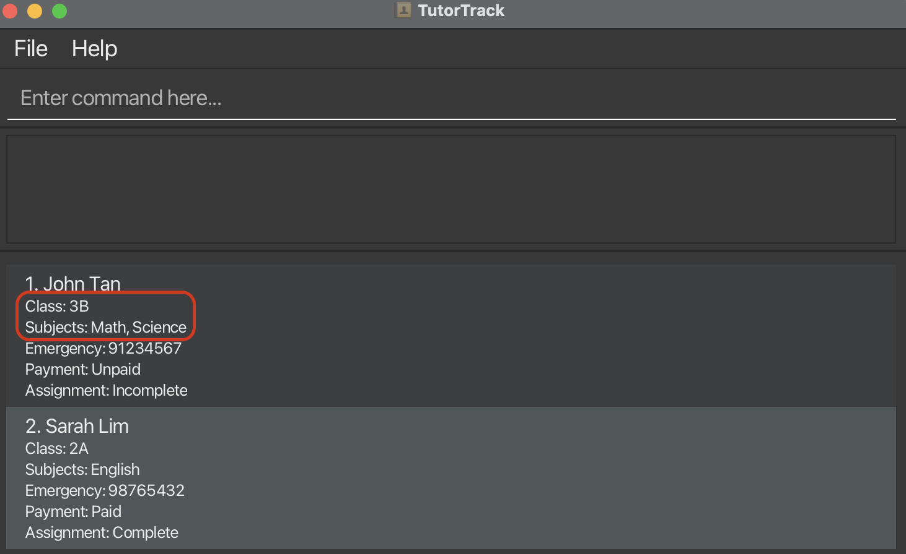</td>
    <td>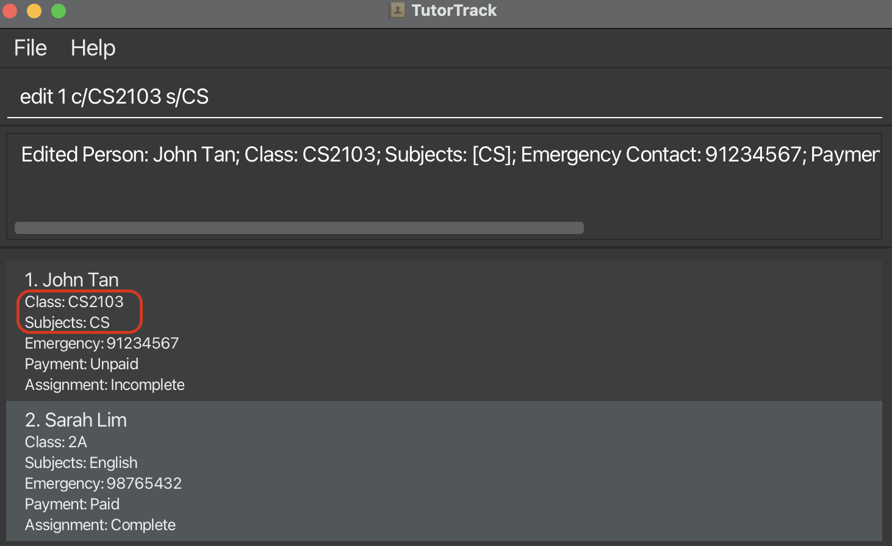</td>
  </tr>
  <tr>
    <td align="center"><em>Figure 3a: Before editing fields</em></td>
    <td align="center"><em>Figure 3b: After editing class & subjects</em></td>
  </tr>
</table>

{:start="2"}
1.	Changing a student's payment status
* Command: `edit 2 ps/Unpaid`
  <table>
  <tr>
    <td>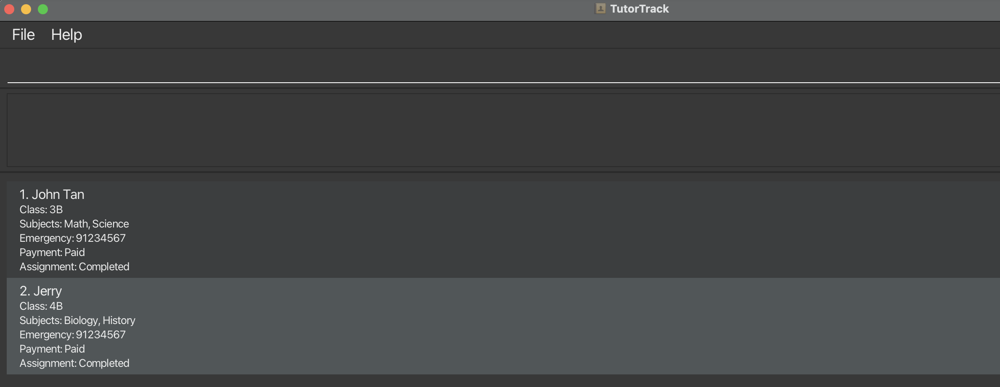</td>
    <td>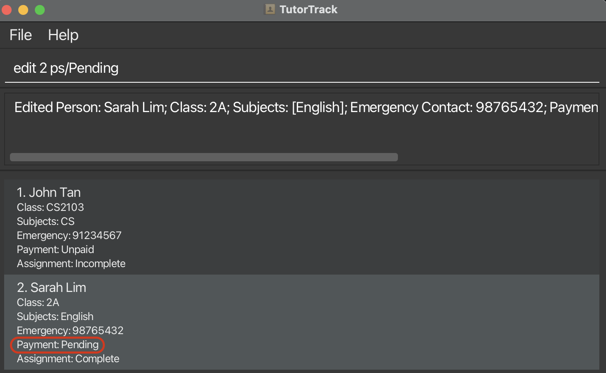</td>
  </tr>
  <tr>
    <td align="center"><em>Figure 4a: Before editing fields</em></td>
    <td align="center"><em>Figure 4b: After setting Jerry's Payment Status to “Unpaid”</em></td>
  </tr>
</table>

<div markdown="block" class="alert alert-warning">:exclamation: **Caution:**

* Provide at least one field to change, otherwise, the command is rejected.
* Ensure the target `INDEX` is visible after any filters (e.g., after find); otherwise you may edit the wrong entry.
* Use consistent subject names to avoid near-duplicate entries (e.g., prefer Math over Mathematics if your list already uses Math).
* If you intend to clear a field, use the app’s documented “clear” variant (if supported) rather than leaving the prefix empty.

</div>

---

### Locating students by name: `find`

Finds students whose names contain any of the given keywords.

**Format:** `find KEYWORD [MORE_KEYWORDS]`

**Parameters:**
* `KEYWORD` — any part of a student's name (case-insensitive)
* Multiple keywords can be supplied, separated by spaces (e.g., `find John Tan`)
* Only full words are matched (e.g., `Han` will not match `Hans`)

**Description**:
* Returns students whose names contain all supplied keywords (AND search)
* The search is case-insensitive. e.g., `hans` matches `Hans`
* The order of keywords does not matter. e.g., `Hans Bo` matches `Bo Hans`
* Only the name field is searched
* If no students match, an empty list is shown

⸻

**Examples:**
1. Finding multiple students
* Command: `find john`
  <figure>
    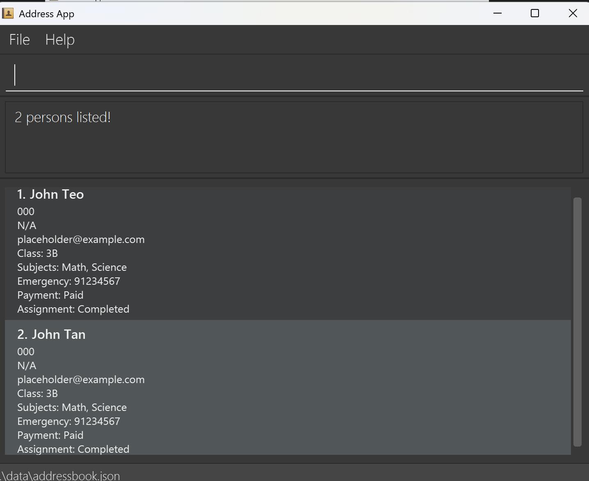
    <figcaption><em>Figure 5: find john shows multiple students from the student list named John</em></figcaption>
  </figure>

{:start="2"}
1. No matching students
* Command: `find alice`
  <figure>
    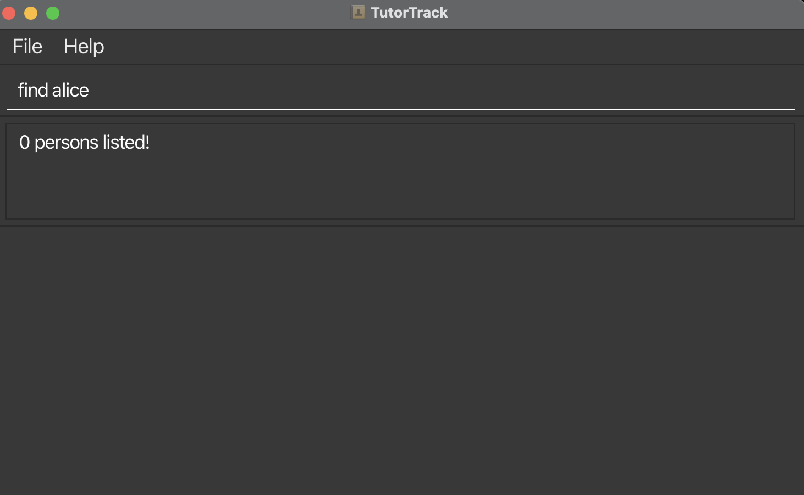
    <figcaption><em>Figure 6: Finding an invalid student generates the following output</em></figcaption>
  </figure>

<div markdown="block" class="alert alert-warning">:exclamation: **Caution:**

* Ensure the target `INDEX` is visible in your current view after any filters (e.g., after `find`).
* Only students matching all keywords are shown; partial matches are not included.
* If you intend to search by other fields (e.g., subject, class), use the appropriate command or filter.
* The `find` command searches within the currently displayed list (current or archive) and only returns results from that list

</div>

### Deleting a student : `delete`

Deletes the specified student from the student list.

**Format:** `delete INDEX`

**Parameters:**
* `INDEX` — the position of the student in the currently displayed list (must be a positive integer) (**required**)

**Description:**
* Deletes the student at the specified `INDEX`. This action is **irreversible**
* The index refers to the index number shown in the displayed student list
* `delete` only removes students from the list you are currently viewing (current or archive)
* The command works on the last shown list of students, which may be filtered (e.g., after using `find`)
* If the provided index is not an integer, negative or out of range, an error message will be shown

⸻

**Examples:**
1. Deleting a student from the main list
* Command: `list` followed by `delete 3`
  <table>
    <tr>
      <td>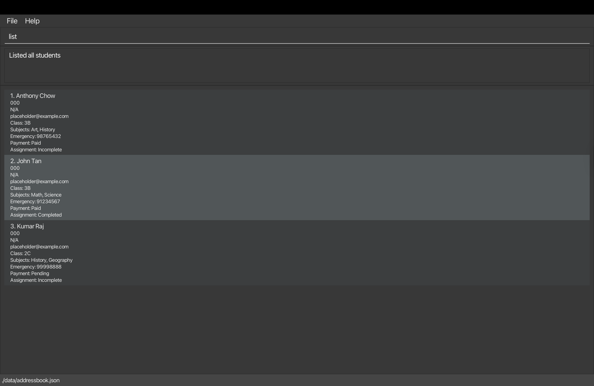</td>
      <td>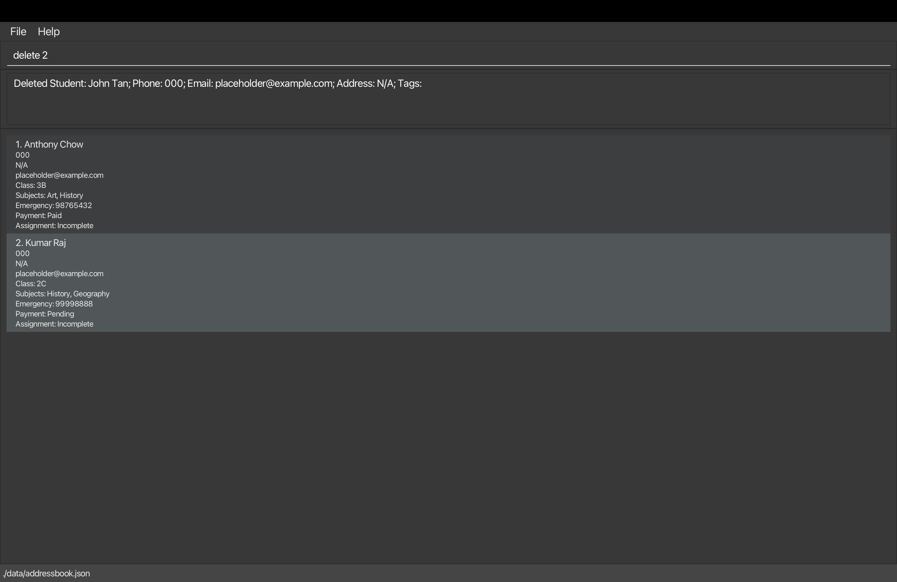</td>
    </tr>
    <tr>
      <td align="center"><em>Figure 7a: Student List before deleting John Lee</em></td>
      <td align="center"><em>Figure 7b: Student List after the command delete 3 is run</em></td>
    </tr>
  </table>

{:start="2"}
1. Deleting a student from a filtered list
* Command: `find John` followed by `delete 2`
  <table>
    <tr>
      <td></td>
      <td>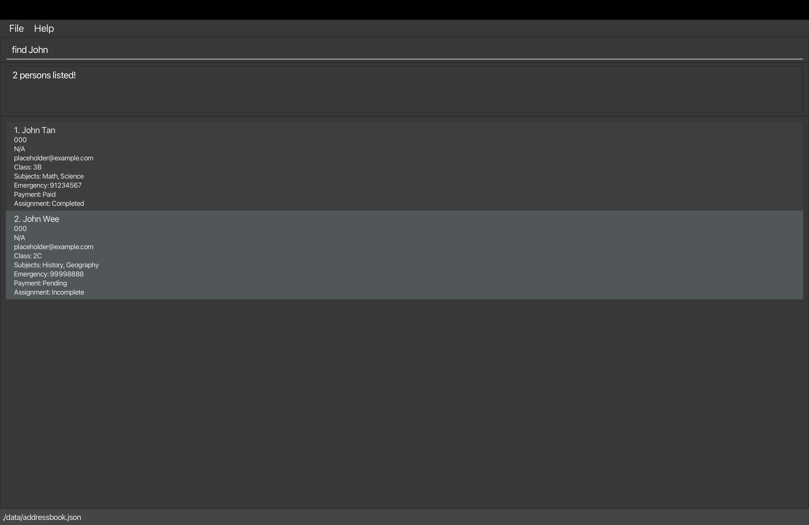</td>
    </tr>
    <tr>
      <td align="center"><em>Figure 8a: Filtered Student List before deleting John Lee</em></td>
      <td align="center"><em>Figure 8b: Filtered Student List after the command delete 2 is run</em></td>
    </tr>
  </table>

{:start="3"}
1. Invalid index
* Command: `delete 5` (when there are only 2 or fewer students)
  **Error:** "The person index provided is invalid"
  <figure>
    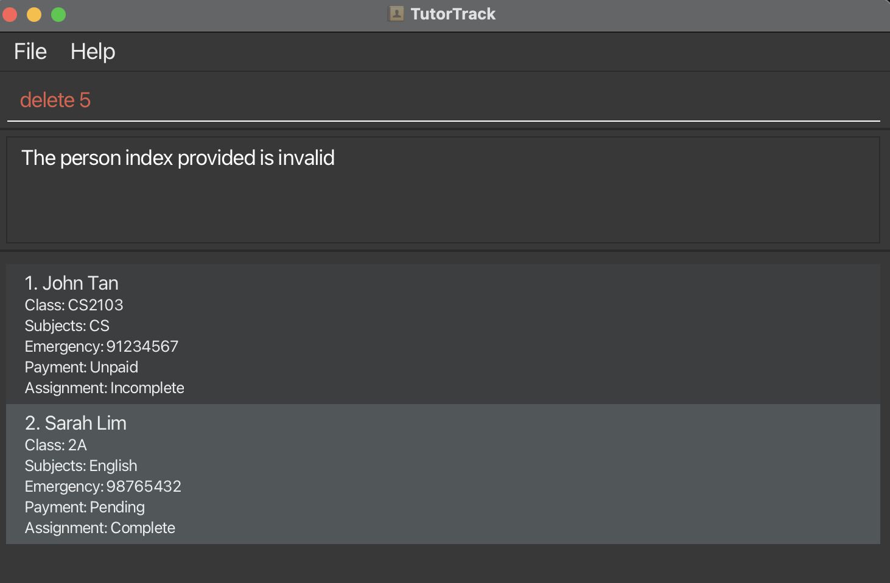
    <figcaption><em>Figure 9: An example of an invalid delete command</em></figcaption>
  </figure>

---

### Archiving a student : `archive`

Moves a student from your active list into the archive list in TutorTrack.

**Format:** `archive INDEX`

**Parameters:**
* `INDEX` — the position of the student in the currently displayed list (must be a positive integer) (**required**)

**Description:**
* Archives the student at the specified `INDEX`.
* Archived students are **not deleted** — they remain in the system and can be viewed using `listarchive`.
* Archived students are hidden from the main student list but **preserved** in the data file.
* Use this for students you're no longer actively tutoring but want to keep records for.

⸻

**Examples:**
1. Archiving a student from the main list
* Command: `archive 2`
  <table>
  <tr>
    <td>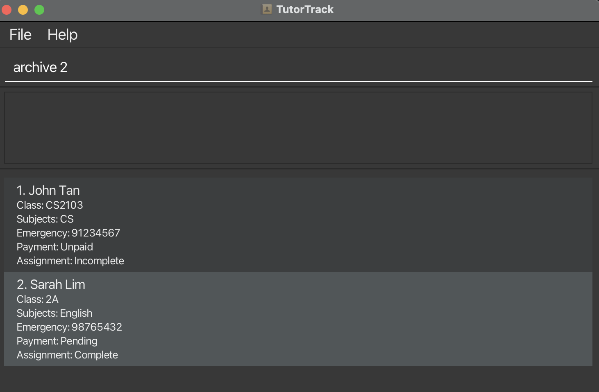</td>
    <td>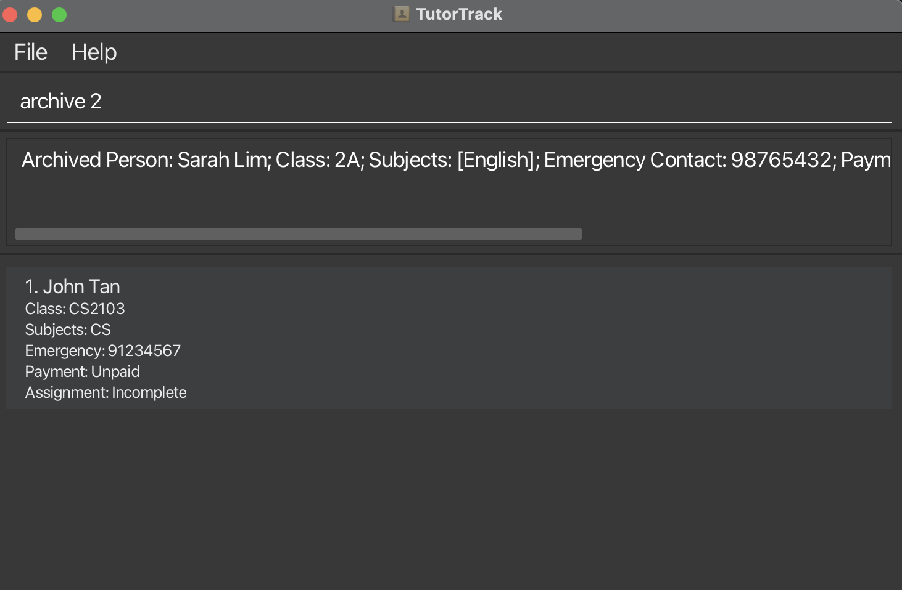</td>
  </tr>
  <tr>
    <td align="center"><em>Figure 10a: Student List before archiving Sarah Lim</em></td>
    <td align="center"><em>Figure 10b: Student List after Sarah is archived</em></td>
  </tr>
  </table>

{:start="2"}
1. Archiving a student from filtered results
* Command: `find John` followed by `archive 1`
  <figure>
    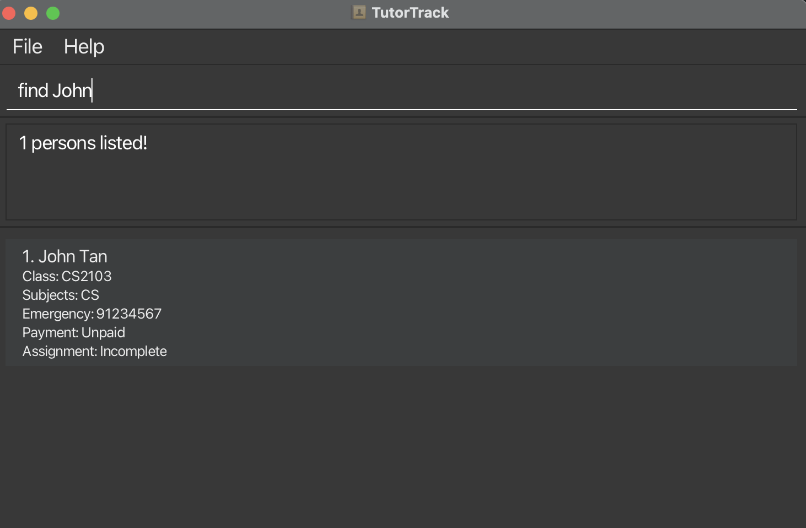
    <figcaption><em>Figure 11a: Find the desired student</em></figcaption>
  </figure>
  <table>
  <tr>
    <td></td>
    <td>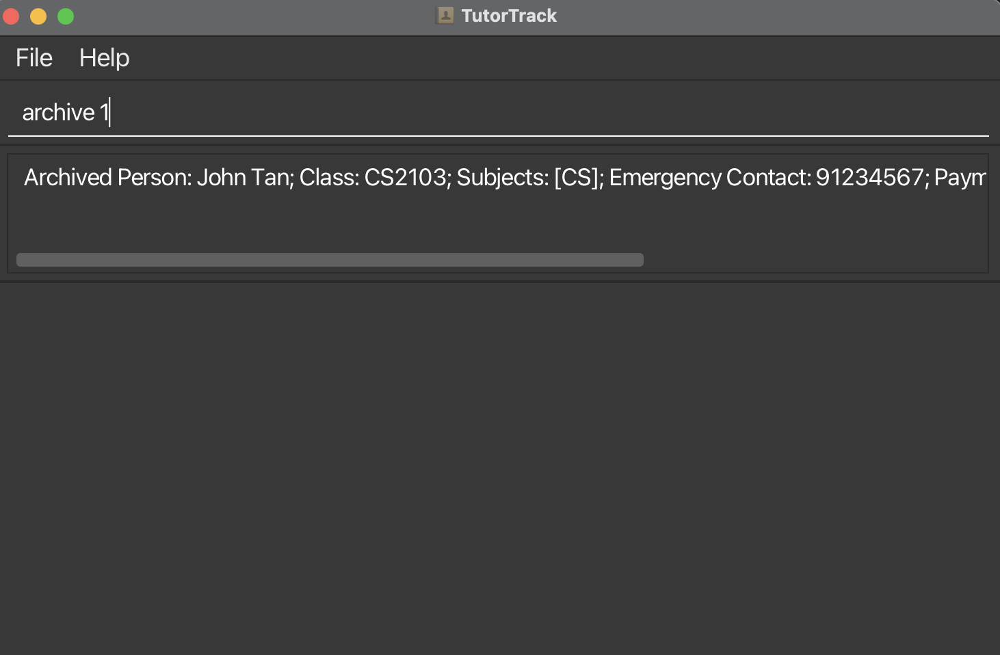</td>
  </tr>
  <tr>
    <td align="center"><em>Figure 11b: Index is based on filtered list (1 in this case)</em></td>
    <td align="center"><em>Figure 11c: John is successfully archived</em></td>
  </tr>
  </table>

<div markdown="block" class="alert alert-warning">:exclamation: **Caution:**

* Ensure the target `INDEX` is visible in your current view after any filters (e.g., after `find`).
* The `INDEX` refers to the position in the **displayed list**, not the complete list of all students.

</div>

---

### Unarchiving a student : `unarchive`

Moves a student from the archive list back to your active student list in TutorTrack.

**Format:** `unarchive INDEX`

**Parameters:**
* `INDEX` — the position of the student in the archive list (must be a positive integer) (**required**)

**Description:**
* Unarchives the student at the specified `INDEX` from the archive list.
* The student will be moved back to your main active student list.
* Use `listarchive` first to view archived students and identify the correct `INDEX`.
* All student details (subjects, attendance, payment status, etc.) are preserved when unarchiving.

⸻

**Examples:**
1. Unarchiving a student from the archive list
* Command: `unarchive 1`
  <figure>
    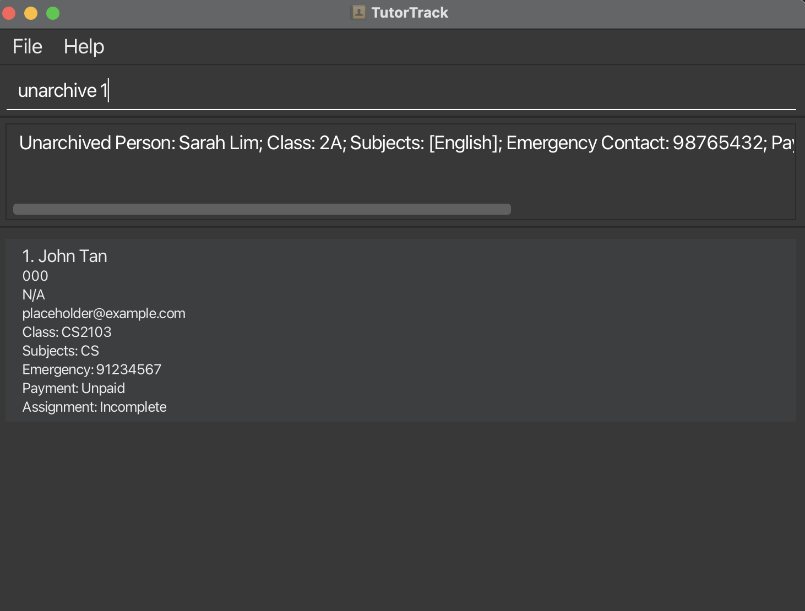
    <figcaption><em>Figure 12a: Unarchiving Oliver Lee from the archive list</em></figcaption>
  </figure>

{:start="2"}
1. Attempting to unarchive with an invalid index
* Command: `unarchive 2`
  <figure>
    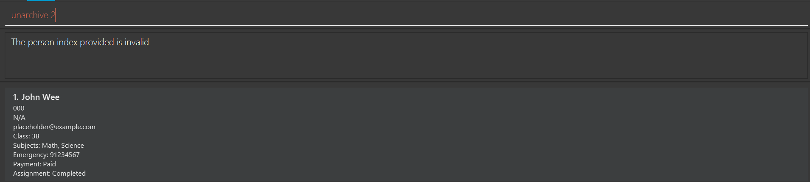
    <figcaption><em>Figure 12b: Error message when using an invalid index</em></figcaption>
  </figure>

<div markdown="block" class="alert alert-warning">:exclamation: **Caution:**

* The `INDEX` refers to the position in the **archive list**, not the main student list.
* Use `listarchive` to see the archive list and verify the correct index before unarchiving.
* If the index is out of range, an error message will be displayed.

</div>

---

### Listing all students : `list`

Shows a list of all active (non-archived) students in the TutorTrack.

**Format:** `list`

**Parameters:**
* This command takes no parameters.

**Description:**
* Displays all students who have not been archived
* Returns you to the active student view if you were viewing archived students
* Students are shown with their index numbers, names, classes, and other details

<div markdown="block" class="alert alert-info">:information_source: **Note:**

No extra params should be added, simply `list`

</div>

**Example:**
1. Listing all current students
* Command: `list`
<figure>
    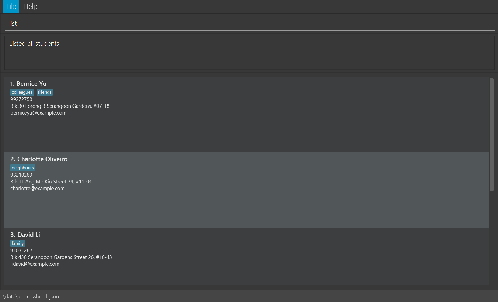
    <figcaption><em>Figure 13: Sample student list shown after the list Command is called</em></figcaption>
</figure>

<div markdown="span" class="alert alert-primary">:bulb: **Tip:**
Use this command to reset any filters and see all active students after using `find` or other filtering commands.
</div>

---

### Viewing archived students : `listarchive`

Displays all archived students in TutorTrack for recordkeeping and reference.

**Format:** `listarchive`

**Parameters:**
* This command takes no parameters.

**Description:**
* Displays a list of all students who have been archived.
* Archived students retain all their details (class, subjects, attendance, payment status, assignment status, etc.).
* Use this command to view or verify students who are no longer actively being tutored.

<div markdown="block" class="alert alert-info">:information_source: **Note:**

No extra params should be added, simply `listarchive`

</div>

⸻

**Example:**
1. Viewing all archived students
* Command: `listarchive`
  <figure>
    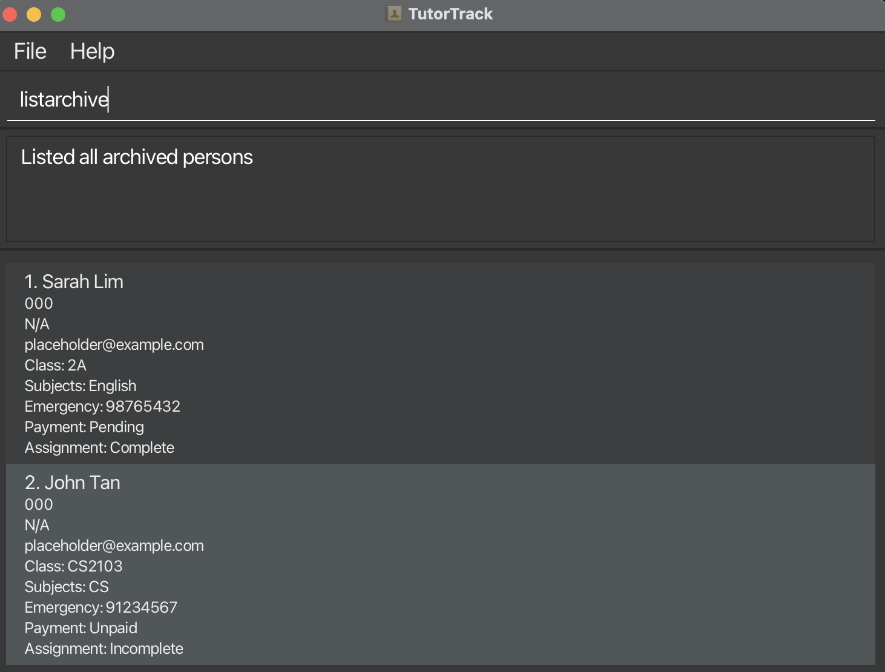
    <figcaption><em>Figure 14: Archive student list showing all archived students</em></figcaption>
  </figure>

<div markdown="block" class="alert alert-info">:information_source: **Note:**

* Archived students are separate from your active student list and won't appear in regular `list` or `find` commands.
* To move a student back to your active list, use the `unarchive` command.

</div>

---

### Clearing all current student entries : `clearcurrent`

Deletes **all current students** from the student list. This action is **irreversible**

**Format:** `clearcurrent`

**Parameters:**
* This command takes no parameters.

**Details:**
* Permanently deletes all active student, lesson and subject records from the **current list**.
* Does **not** affect archived students.
* The data file is automatically updated after the operation.

<div markdown="block" class="alert alert-info">:information_source: **Note:**

No extra params should be added, simply `clearcurrent`

</div>

**Example:**
1. Removes every student, lesson and subject from the current list.
* Command: `clearcurrent`
  <table>
  <tr>
    <td>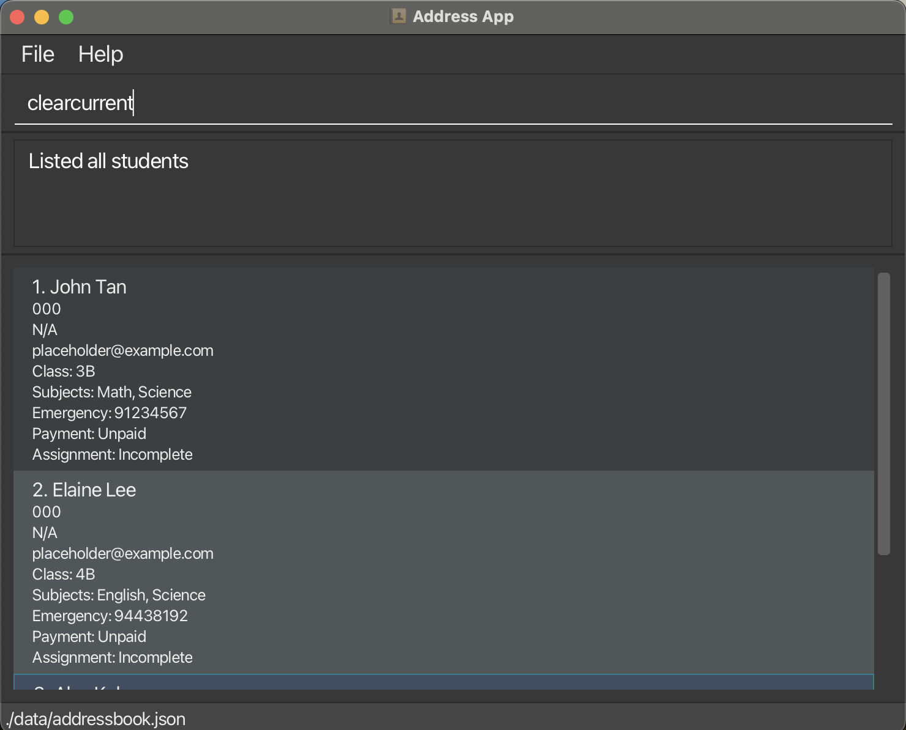</td>
    <td>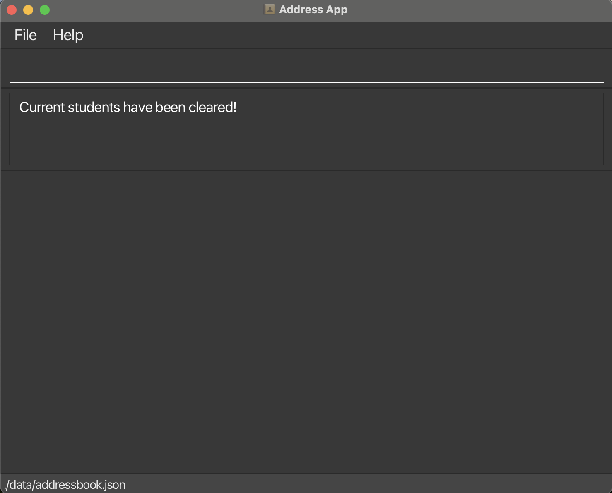</td>
  </tr>
  <tr>
    <td align="center"><em>Figure 15a: Student List before it is cleared</em></td>
    <td align="center"><em>Figure 15b: Student List once all students have been cleared out</em></td>
  </tr>
  </table>


<div markdown="span" class="alert alert-warning">:exclamation:**Caution:**
This command cannot be undone. All active records will be permanently deleted.
Archived records are not affected by this command.</div>

---

### Clearing all archived student entries : `cleararchive`

Deletes **all archived students, lessons and subjects** from the archived list. This action is **irreversible**

**Format:** `cleararchive`

**Parameters:**
* This command takes no parameters.

**Details:**
* Permanently deletes all student records from the **archived list**.
* Does **not** affect current students.
* The data file is automatically updated after the operation.

<div markdown="block" class="alert alert-info">:information_source: **Note:**

No extra params should be added, simply `cleararchive`

</div>

**Example:**
1. Removes every student from the archived list.
* Command: `cleararchive`
  <table>
  <tr>
    <td>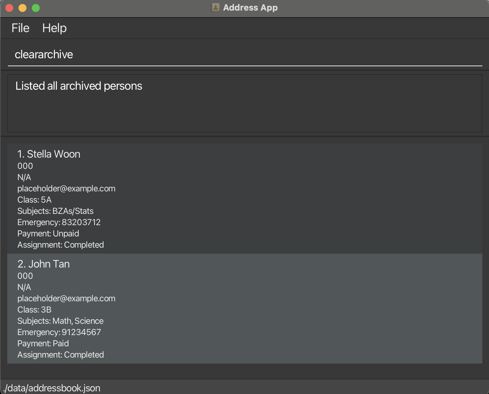</td>
    <td>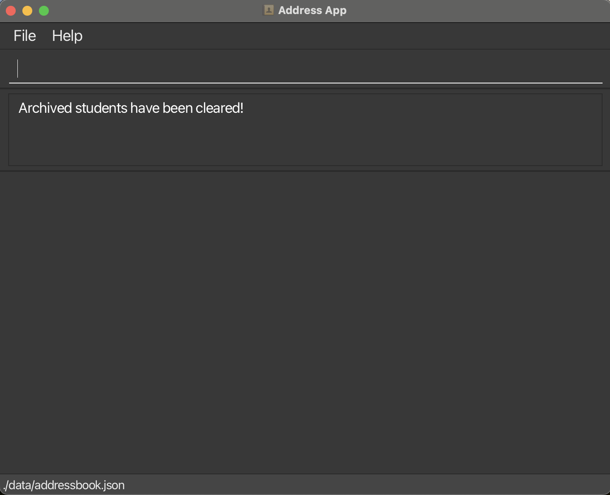</td>
  </tr>
  <tr>
    <td align="center"><em>Figure 16a: Archive Student List before it is cleared</em></td>
    <td align="center"><em>Figure 16b: Archive Student List once all students have been cleared out</em></td>
  </tr>
  </table>

<div markdown="span" class="alert alert-warning">:exclamation:**Caution:**
This command cannot be undone. All active records will be permanently deleted.
Current records are not affected by this command.</div>

---

### Adding a lesson : `addlesson`

Adds a new lesson to a subject in TutorTrack.

**Format:** `addlesson s/SUBJECT n/LESSON`

**Parameters:**
* `s/SUBJECT` - The subject the lesson belongs to (e.g., `Math`) (**required**)
* `n/LESSON` - Lesson name (e.g, `Algebra`) (**required**)

<div markdown="span" class="alert alert-warning">:exclamation: **Caution:**
Adding the same lesson (case-insensitive) multiple times will only result in one instance of the lesson added.
</div>

**Example:**
1. Adds the Algebra lesson in Math subject.
* Command: `addlesson s/Math n/Algebra`
  <figure>
    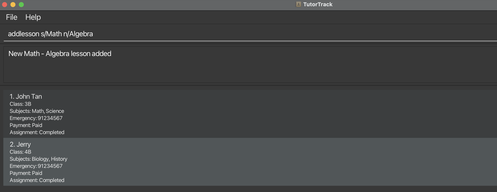
    <figcaption><em>Figure 17: An example of a user adding the Algebra lesson in the Math lesson list</em></figcaption>
  </figure>

<div markdown="block" class="alert alert-info">:information_source: **Note:**
Only one lesson in one subject can be added. To add multiple lessons, use the command multiple times.
</div>

---

### Listing all lessons in a subject : `listlessons`

Shows the list of lessons that falls under the specified subject.

**Format:** `listlessons s/SUBJECT`

**Parameters:**
* `s/SUBJECT` - Subject whose lesson list needs to be viewed (e.g., `Math`) (**required**)

<div markdown="span" class="alert alert-warning">:exclamation: **Caution:**
Only one subject's lesson list can be viewed for each listlessons command
</div>

**Example:**
1. List all the lessons currently in Math's lesson list
* Command: `listlessons s/Math`
  <figure>
    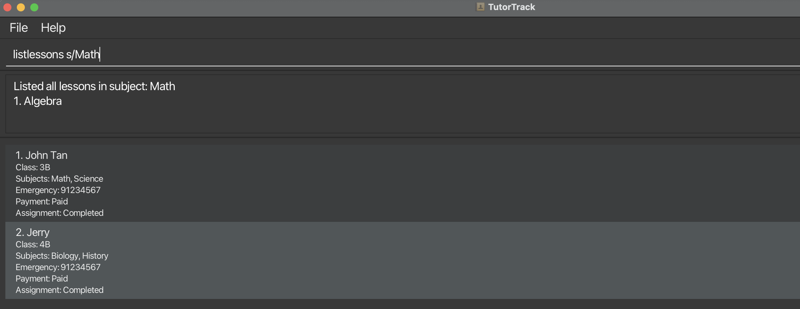
    <figcaption><em>Figure 18: An example of a user viewing all lessons in the Math lesson list.</em></figcaption>
  </figure>

---

### Deleting a lesson : `deletelesson`

Deletes the specified lesson from the lesson list.

**Format:** `deletelesson s/SUBJECT n/LESSON`

**Parameters:**
* `s/SUBJECT` — the subject of the lesson to be deleted. (e.g., `Math`) (**required**)
* `n/LESSON` — the lesson to be deleted. (e.g., `Algebra`) (**required**)

**Description:**
* Deletes the lesson in a specified subject. This action is **irreversible**

⸻

**Example:**
1. Deleting a lesson from the lesson list
* Command: `deletelesson s/Math n/Algebra`
  <figure>
    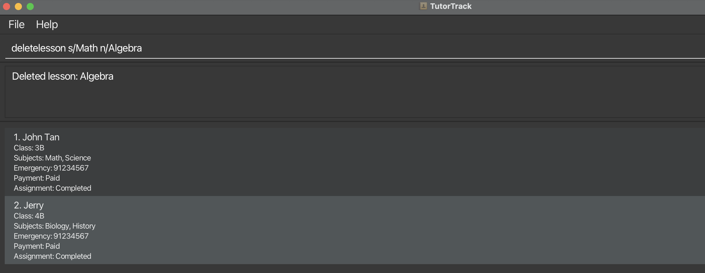
    <figcaption><em>Figure 19: An example of a user deleting the Algebra lesson from the Math lesson list</em></figcaption>
  </figure>

<div markdown="block" class="alert alert-warning">:exclamation: **Caution:**
This command only deletes one lesson from one subject per deletelesson command. To delete multiple lessons, run this command multiple times.
</div>

---

### Marking attendance: `markattendance`

Marks a student’s attendance for a specific lesson.

**Format:** `markattendance n/NAME s/SUBJECT l/LESSON st/STATUS`

**Parameters:**
- `n/` — student’s full name (must match exactly one entry in the **currently displayed** list). (**required**)
- `s/` — subject name (case-insensitive match against the student’s enrolled subjects). (**required**)
- `l/` — lesson name (must exist for the given subject). (**required**)
- `st/` — attendance status. One of: `PRESENT`, `ABSENT`, `LATE`, `EXCUSED`. (**required**)

**Description:**
- Finds the student by **name** within the **current filtered list** and marks attendance for the given `SUBJECT` and `LESSON`.
- The student **must already be a Student** (not a generic Person), must be **enrolled** in the specified subject, and the lesson must **exist** for that subject.
- Subject matching is **case-insensitive** (e.g., `math` matches `Math`).
- On success, a confirmation message summarises: student, subject, lesson, and status.

---

**Examples**

1. Mark John Tan present for Algebra (Math)
* Command: `markattendance n/John Tan s/Math l/Algebra st/PRESENT`
<figure>
  
  <figcaption><em>Figure 20: After running the command — attendance marked as PRESENT for John Tan (Math → Algebra)</em></figcaption>
</figure>

{:start="2"}
1. Change Jane Lee’s attendance from Absent to Excused for Calculus (Math)
Commands:
* `markattendance n/Jane Lee s/Math l/Calculus st/ABSENT` (left image)
* `markattendance n/Jane Lee s/Math l/Calculus st/EXCUSED` (right image)

<table>
  <tr>
    <td>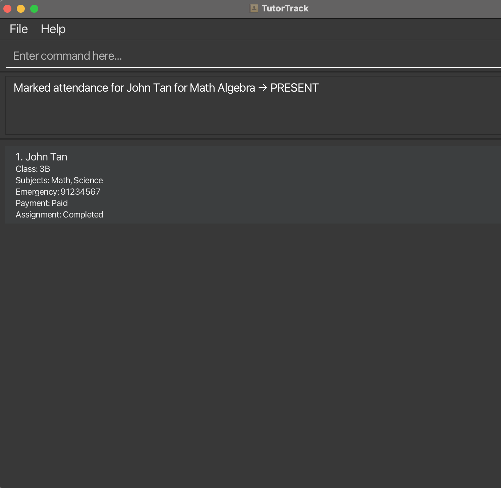</td>
    <td>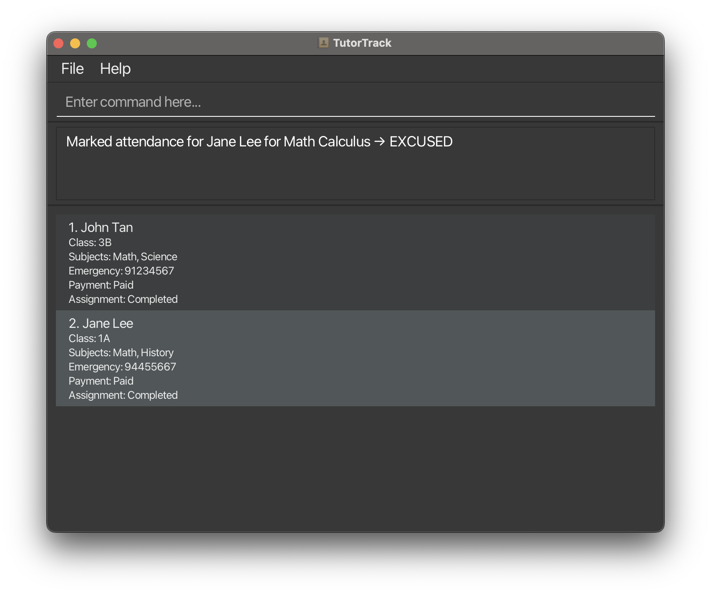</td>
  </tr>
  <tr>
    <td align="center"><em>Figure 21a: Before editing attendance (status: ABSENT)</em></td>
    <td align="center"><em>Figure 21b: After changing status to “EXCUSED”</em></td>
  </tr>
</table>


<div markdown="block" class="alert alert-warning">:exclamation: **Caution**

- The student is searched **only within the currently displayed list**. If you used `find` or applied filters, ensure the target student is visible before running the command.
- The student must be **enrolled** in `s/SUBJECT`; otherwise, the command fails.
- The `l/LESSON` must already **exist** for that subject in the app; otherwise, the command fails.
- Use the exact lesson name you created (spelling/spacing must match).
- Allowed statuses are exactly: `PRESENT`, `ABSENT`, `LATE`, `EXCUSED`.
</div>

---

### Viewing attendance records: `listattendance`

Displays a student’s attendance records for a specific subject.

**Format:** `listattendance n/NAME s/SUBJECT`

**Parameters:**
- `n/` — student’s full name (must match exactly one entry in the **currently displayed** list) (**required**)
- `s/` — subject name (case-insensitive match against the student’s enrolled subjects) (**required**)

**Description:**
- Shows a detailed list of all lessons and their corresponding attendance statuses for the given student and subject.
- The student must already be a **Student** (not a generic Person) and must be **enrolled** in the specified subject.
- Each record line displays the **Lesson name** and its **attendance status** (e.g., `Algebra PRESENT`, `Calculus LATE`).
- If no attendance records exist for that subject, an error message will be shown.

---

**Example**

1. List John Tan’s attendance for Math
* Command: `listattendance n/John Tan s/Math`
<figure>
  
  <figcaption><em>Figure 22: Listing attendance for John Tan’s Math lessons</em></figcaption>
</figure>

<div markdown="block" class="alert alert-warning">:exclamation: **Caution**

- The student is searched **only within the currently displayed list**. Ensure the target student is visible before running the command.
- The student must be **enrolled** in the specified subject; otherwise, the command will fail.
- If there are **no attendance records** for that subject, you’ll receive an error message instead of an empty list.
- Subject names are matched **case-insensitively** (e.g., `math` matches `Math`).

</div>

---

### Viewing help : `help`

Shows a message with a link to access the full help page.

**Format:** `help`

**Parameters:**
* This command takes no parameters.

**Description:**
* Upon using this command, a help window opens with a link to this user guide.

<div markdown="block" class="alert alert-info">:information_source: **Note:**
No extra params should be added, simply `help`
</div>

**Example:**
1. Using help command
* Command: `help`
  <figure>
    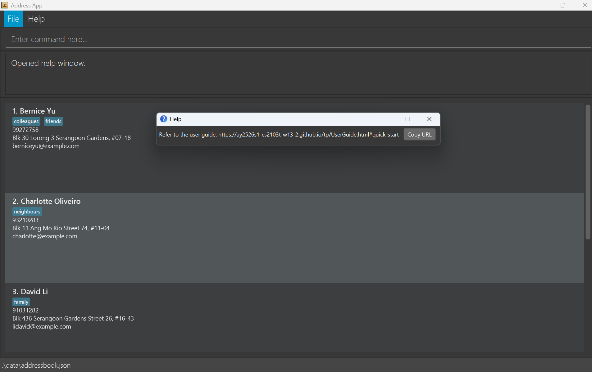
    <figcaption><em>Figure 23: Help Window</em></figcaption>
  </figure>

---

### Exiting the program : `exit`

Exits the program.

**Format:** `exit`

**Parameters:**
* This command takes no parameters.

**Description:**
* Upon using this command, the user exits the application

<div markdown="block" class="alert alert-info">:information_source: **Note:**

No extra params should be added, simply `exit`
</div>

---

## Command Summary

| Action | Format, Examples (if necessary)                                                                                                                                                                          |
|--------|----------------------------------------------------------------------------------------------------------------------------------------------------------------------------------------------------------|
| **Help** | `help`                                                                                                                                                                                                   |
| **Add** | `add n/NAME c/CLASS s/SUBJECT [s/MORE_SUBJECT]... ec/EMERGENCY_CONTACT [ps/PAYMENT_STATUS] [as/ASSIGNMENT_STATUS]`<br> e.g., `add n/"John Tan" c/3B s/Math s/Science ec/91234567 ps/Paid as/Completed`     |
| **List** | `list`                                                                                                                                                                                                   |
| **Edit** | `edit INDEX [n/NAME] [c/CLASS] [s/SUBJECT]... [ec/EMERGENCY_CONTACT] [ps/PAYMENT_STATUS] [as/ASSIGNMENT_STATUS]`<br> e.g., `edit 2 n/"Betsy Crower" c/4A s/Math, Science ec/98212312 ps/Paid as/Completed` |
| **Find** | `find KEYWORD [MORE_KEYWORDS]`                                                                                                                                                                           |
| **Delete** | `delete INDEX` <br> e.g., `delete 2`                                                                                                                                                                     |
| **Archive** | `archive INDEX` <br> e.g., `archive 3`                                                                                                                                                                   |
| **List Archived** | `listarchive`                                                                                                                                                                                            |
| **Unarchive** | `unarchive INDEX` <br> e.g., `unarchive 1`                                                                                                                                                               |
| **Mark Attendance** | `markattendance n/NAME s/SUBJECT l/LESSON st/STATUS` <br> e.g., `markattendance n/John Tan s/Math l/Algebra st/PRESENT`                                                                                  |

| **List Attendance** | `listattendance n/NAME s/SUBJECT` <br> e.g., `listattendance n/John Tan s/Math`

| **List Lessons** | `listlessons` <br> e.g, `listlessons s/Mathematics`                                                                                                                       
| **Add Lessons** | `addlesson` <br> e.g, `addlesson s/Math n/Algebra`                                                                                                                                 
| **Delete Lessons** | `deletelesson` <br> e.g, `deletelesson s/Math n/Algebra`

| **Clear** |`clearcurrent`                                                                                                                                                                       
| **Clear Archive**| `cleararchive`                                                                                                                                                                                       
| **Exit** | `exit`                                                                                                                                                                                                   |

### Saving the data

TutorTrack data are saved in the hard disk automatically after any command that changes the data. There is no need to save manually.

### Editing the data file

TutorTrack data are saved automatically as a JSON file `[JAR file location]/data/tutortrack.json`. Advanced users are welcome to update data directly by editing that data file.

<div markdown="span" class="alert alert-warning">:exclamation: **Caution:**
If your changes to the data file makes its format invalid, TutorTrack will discard all data and start with an empty data file at the next run. Hence, it is recommended to take a backup of the file before editing it.<br>
Furthermore, certain edits can cause the TutorTrack to behave in unexpected ways (e.g., if a value entered is outside of the acceptable range). Therefore, edit the data file only if you are confident that you can update it correctly.
</div>

--------------------------------------------------------------------------------------------------------------------

## FAQ

**Q**: How do I transfer my data to another computer?
**A**: Install TutorTrack on the other computer and copy your data file from the old computer to the new one:

1. On the source computer, locate the data file at `[JAR file location]/data/tutortrack.json` (or the folder you used to run the app).
2. Make a backup copy (for example, `tutortrack.json.bak`).
3. Install and run TutorTrack on the destination computer once (this creates an initial empty data file), then exit the app.
4. Overwrite the newly-created `tutortrack.json` with your backed-up file.
5. Start TutorTrack — your data should appear.

Notes:
- The data file is JSON; keep the filename and structure unchanged when copying.
- If you're switching between different app versions (or custom builds), check compatibility before overwriting.

**Q**: Where is the data file stored on Windows, macOS and Linux?
**A**: By default TutorTrack saves data next to the JAR you run, in a `data` folder (for example, `C:\path\to\folder\data\tutortrack.json` on Windows). If you launched TutorTrack from a different folder, look for `data/tutortrack.json` in that folder.

**Q**: How do I back up my data?
**A**: Copy the `data/tutortrack.json` file to a safe location (external drive, encrypted cloud storage, or another folder). Keep dated backups so you can revert to an earlier copy if needed.

**Q**: What if I accidentally corrupt the data file?
**A**: If the data file is invalid JSON or malformed, TutorTrack may start with an empty data file. To recover:

1. Replace `data/tutortrack.json` with your most recent backup.
2. If no backup exists and you understand JSON, try to repair the file manually using a JSON validator/editor.
3. If repair isn't possible, you'll need to re-create the records in the app.

**Q**: The app window opens off-screen (multi-monitor issue). What do I do?
**A**: If the app was moved to a secondary monitor and that monitor was later removed, the window may open off-screen. To fix this:

- Close TutorTrack.
- Delete `preferences.json` in the same folder as the app (this resets window position preferences).
- Restart TutorTrack — the window will open on the primary display.

**Q**: The Help Window is minimized and doesn't re-open. How can I restore it?
**A**: Use your OS window manager (Alt+Tab, or click the taskbar/dock icon) to restore the Help window. If that fails, restart TutorTrack.

--------------------------------------------------------------------------------------------------------------------

## Known issues

1. **When using multiple screens**, if you move the application to a secondary screen, and later switch to using only the primary screen, the GUI will open off-screen. The remedy is to delete the `preferences.json` file created by the application before running the application again.

2. **If you minimize the Help Window** and then run the `help` command (or use the `Help` menu, or the keyboard shortcut `F1`) again, the original Help Window will remain minimized, and no new Help Window will appear. The remedy is to manually restore the minimized Help Window.

------------------------------------------------------------------------------------------------------------
