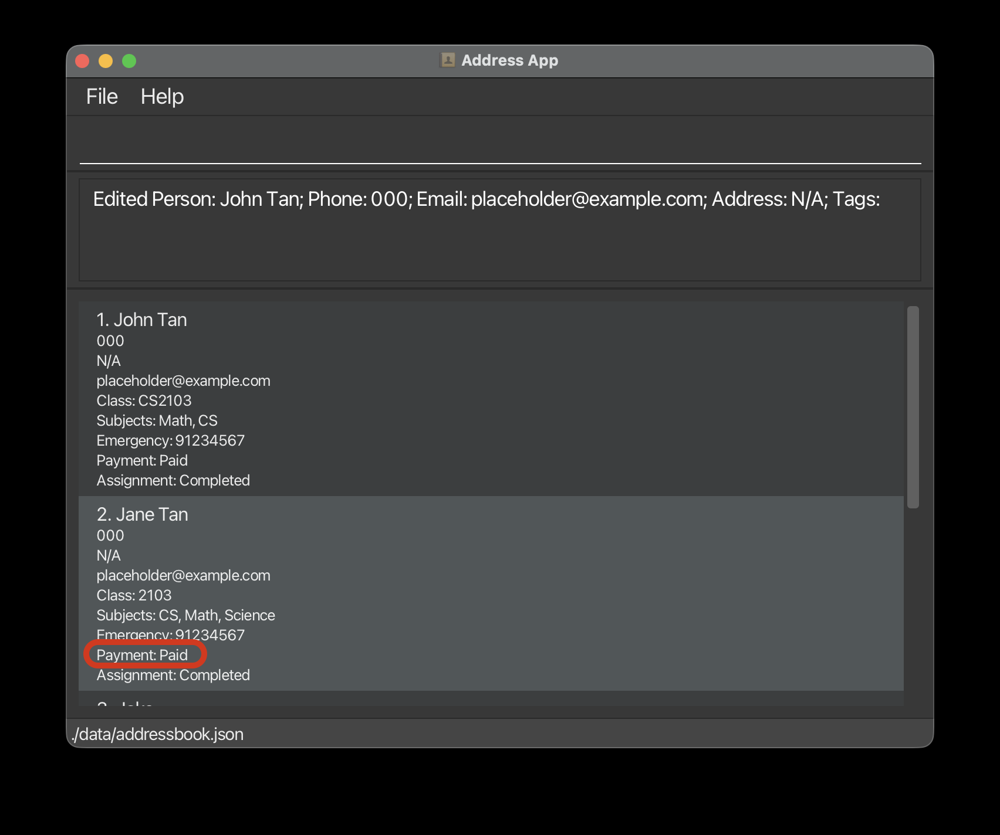
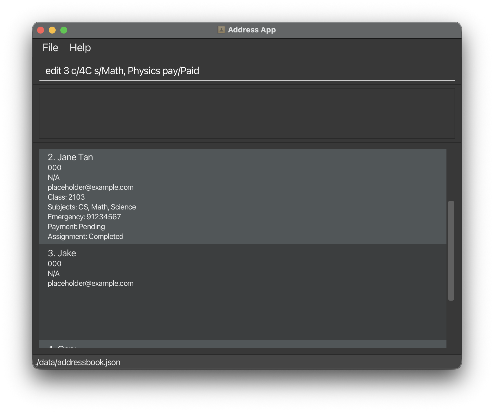
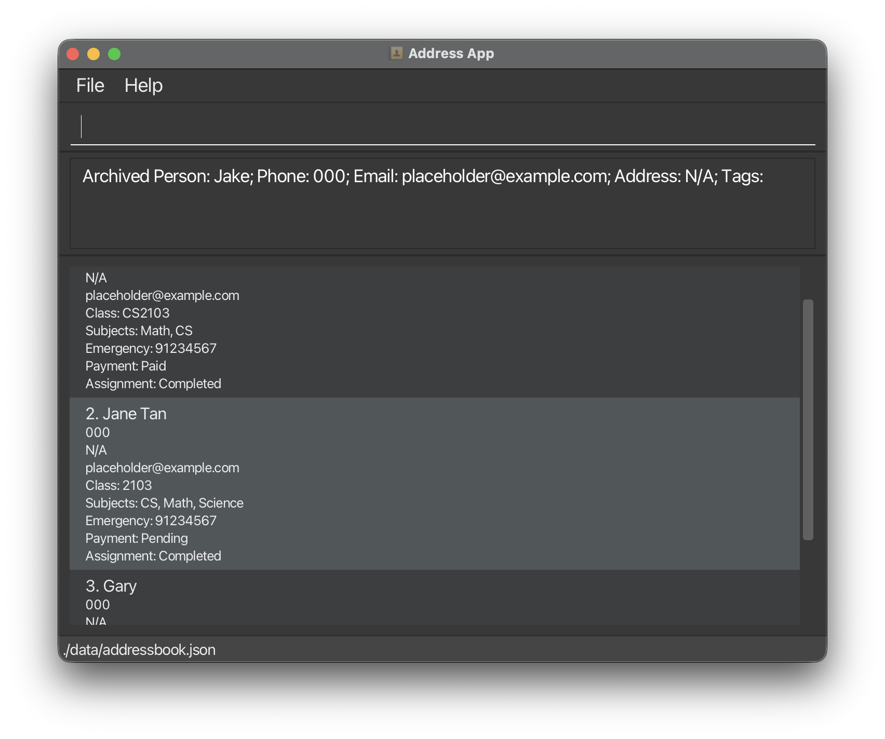
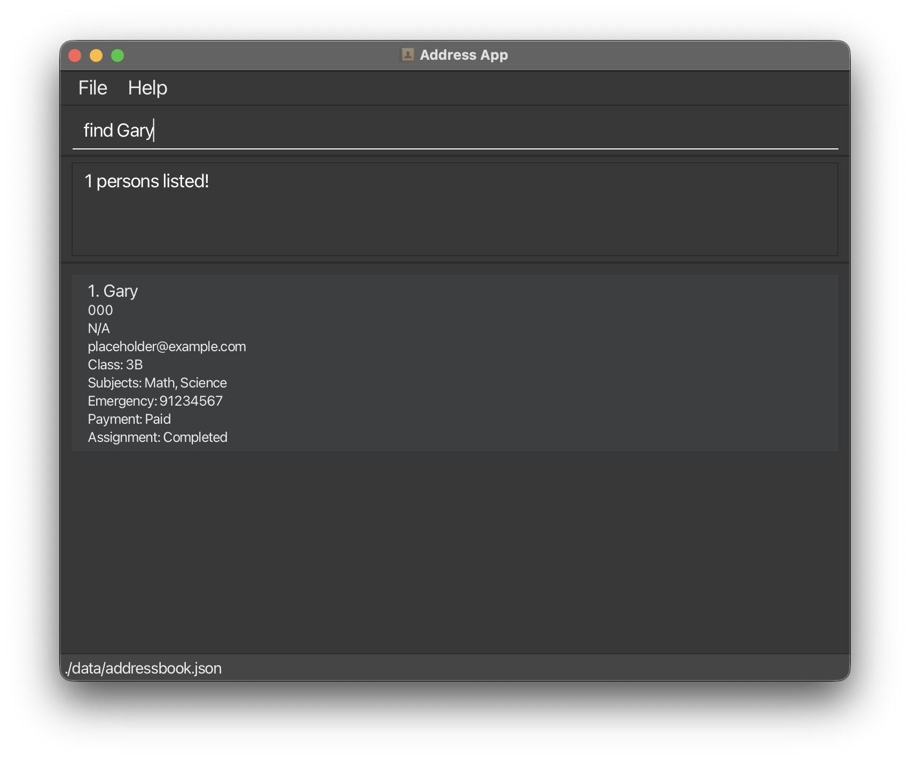
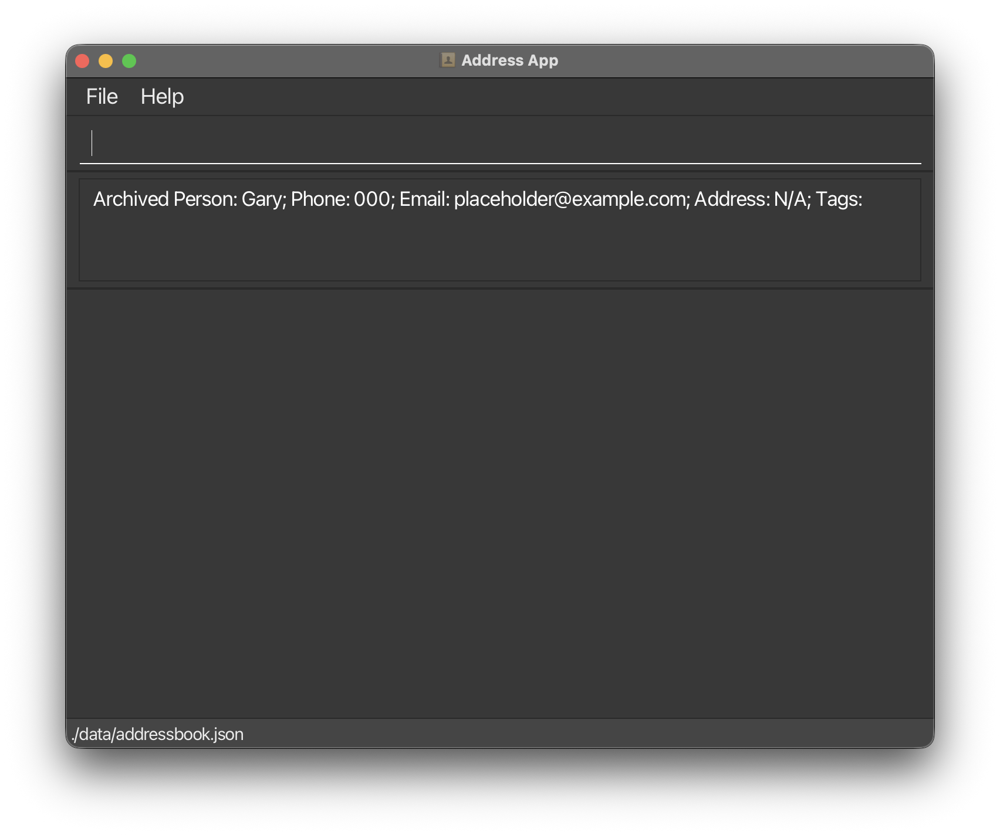
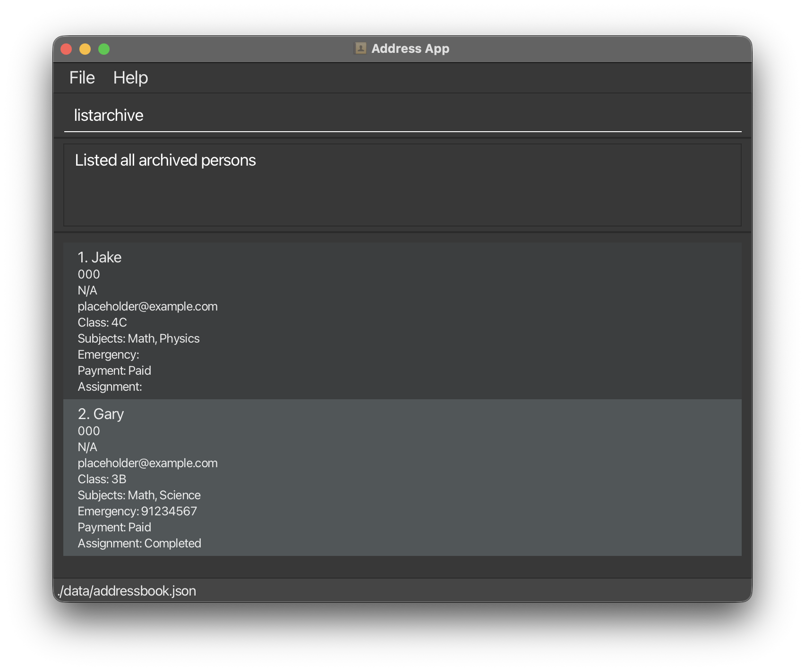
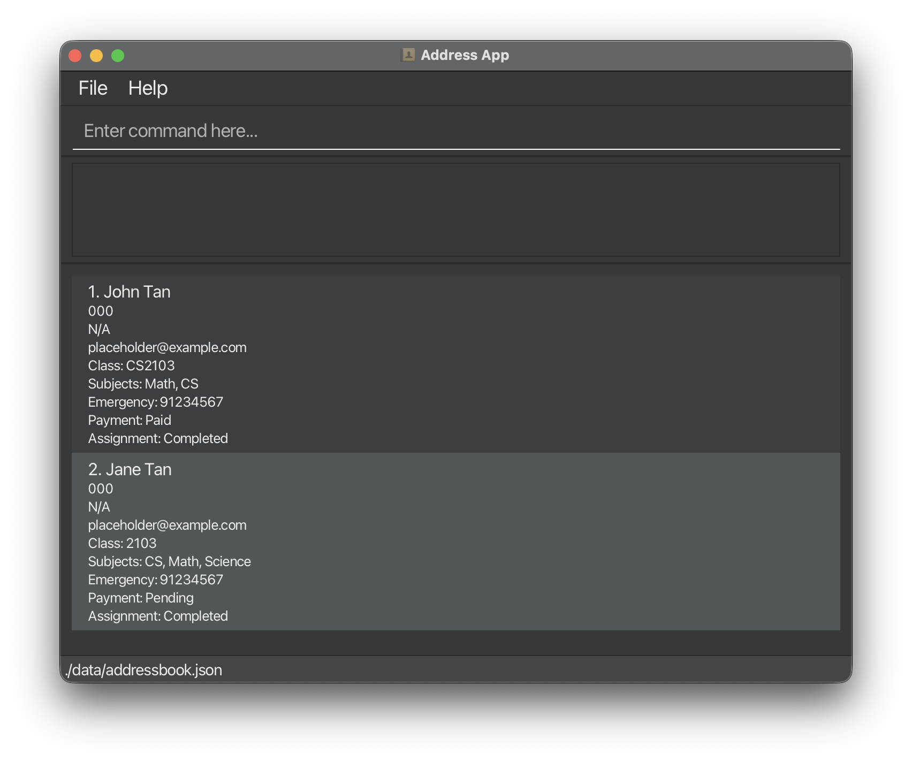
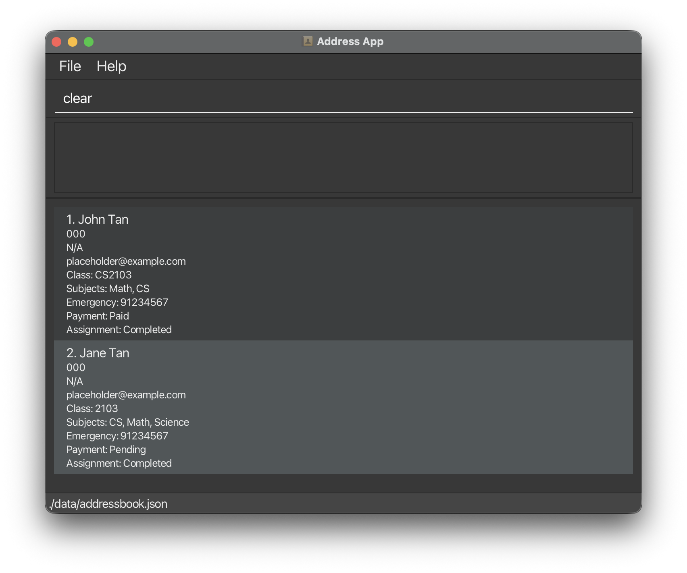
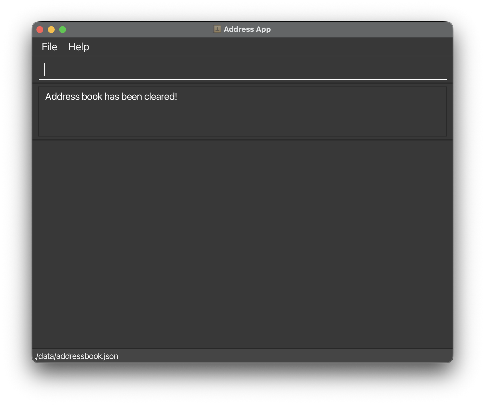

TutorTrack is a **desktop app for managing contacts, optimized for use via a Command Line Interface** (CLI) while still having the benefits of a Graphical User Interface (GUI). If you can type fast, AB3 can get your student management tasks done faster than traditional GUI apps. It is designed to help you, as a tutor, efficiently organise and track your students. This includes adding, deleteing and archiving students as well as a students studental information such as name, subjects, payment status, attendance and much more.

* Table of Contents
{:toc}

--------------------------------------------------------------------------------------------------------------------

## Quick start

1. Ensure you have Java `17` or above installed in your Computer. 
   **Mac users:** Ensure you have the precise JDK version prescribed [here](https://se-education.org/guides/tutorials/javaInstallationMac.html).

1. Download the latest `.jar` file from [here](https://github.com/se-edu/addressbook-level3/releases).

1. Copy the file to the folder you want to use as the _home folder_ for your AddressBook.

1. Open a command terminal, `cd` into the folder you put the jar file in, and use the `java -jar addressbook.jar` command to run the application. 
   A GUI similar to the below should appear in a few seconds. Note how the app contains some sample data. 
   

1. Type the command in the command box and press Enter to execute it. e.g. typing **`help`** and pressing Enter will open the help window. 
   Some example commands you can try:

   * `list` : Lists all students.

   * `add n/John Tan c/3B s/Math s/Science ec/91234567 att/Present pay/Paid asg/Completed` : Adds a student named `John Tan` to the Address Book.

   * `delete 3` : Deletes the 3rd student shown in the current list.

   * `clear` : Deletes all students.

   * `exit` : Exits the app.

1. Refer to the [Features](#features) below for details of each command.

--------------------------------------------------------------------------------------------------------------------

## Features

**:information_source: Notes about the command format:** 

* Words in `UPPER_CASE` are the parameters to be supplied by the user. 
  e.g. in `add n/NAME`, `NAME` is a parameter which can be used as `add n/John Doe`.

* Items in square brackets are optional. 
  e.g `n/NAME [t/TAG]` can be used as `n/John Doe t/friend` or as `n/John Doe`.

* Items with `…`​ after them can be used multiple times including zero times. 
  e.g. `[t/TAG]…​` can be used as ` ` (i.e. 0 times), `t/friend`, `t/friend t/family` etc.

* Parameters can be in any order. 
  e.g. if the command specifies `n/NAME p/PHONE_NUMBER`, `p/PHONE_NUMBER n/NAME` is also acceptable.

* Extraneous parameters for commands that do not take in parameters (such as `help`, `list`, `exit` and `clear`) will be ignored. 
  e.g. if the command specifies `help 123`, it will be interpreted as `help`.

* If you are using a PDF version of this document, be careful when copying and pasting commands that span multiple lines as space characters surrounding line-breaks may be omitted when copied over to the application.

### Viewing help : `help`

Shows a message explaining how to access the help page.

Format: `help`

### Adding a student: `add`

Adds a student to the address book.

Format: `add n/NAME c/CLASS s/SUBJECT [s/SUBJECT]... ec/EMERGENCY_CONTACT [att/ATTENDANCE] [pay/PAYMENT_STATUS] [asg/ASSIGNMENT_STATUS]​`

:bulb: **Tip:**
A student can have any number of tags (including 0)

Examples:
* `add n/John Tan c/3B s/Math s/Science ec/91234567 att/Present pay/Paid asg/Completed`
* `add n/Sam Lee c/3B s/Art s/History ec/98765432 att/Absent pay/Paid asg/Incomplete`

### Listing all students : `list`

Shows a list of all students in the address book.

Format: `list`

### Editing a student : `edit`

Edits an existing student in the address book.

Format: `edit INDEX [n/NAME] [p/PHONE] [e/EMAIL] [a/ADDRESS] [t/TAG]…​`

* Edits the student at the specified `INDEX`. The index refers to the index number shown in the displayed student list. The index **must be a positive integer** 1, 2, 3, …​
* At least one of the optional fields must be provided.
* Existing values will be updated to the input values.
* When you edit a Person (not originally a Student) with Student fields, they will be converted to Students, with their relevant fields updated to match Student fields.  
* When editing tags, the existing tags of the student will be removed i.e adding of tags is not cumulative.
* You can remove all the student’s tags by typing `t/` without
    specifying any tags after it.
* You can also edit **student-specific details**, such as:
  - `c/` → Student class  
  - `s/` → Subject(s) (you may specify multiple)  
  - `ec/` → Emergency contact  
  - `att/` → Attendance status (`Present`, `Absent`, `Late`, or `Excused`)  
  - `pay/` → Payment status (e.g. `Paid`, `Pending`, `Overdue`)  
  - `asg/` → Assignment status (e.g. `Submitted`, `Incomplete`, `Not Submitted`)

**Examples:**
* `edit 1 c/CS2103 s/Math, CS`  
  Edits the **phone number** and **email address** of the 1st student.
  <figure>
    
    <figcaption><em>Before editing the student</em></figcaption>
  </figure>
  <figure>
    
    <figcaption><em>After editing the student</em></figcaption>
  </figure>
  
* `edit 2 pay/Pending`  
  Edits the **Payment Status** of the 2nd student and clears all existing tags.
  <figure>
    
    <figcaption><em>Before editing the student</em></figcaption>
  </figure>
  <figure>
    
    <figcaption><em>After editing the student</em></figcaption>
  </figure>
* `edit 3 c/4C s/Math, Physics pay/Paid`  
  Updates the class, subjects, and payment status of a Person, making them into a Student.
  <figure>
    
    <figcaption><em>Before editing the student</em></figcaption>
  </figure>
  <figure>
    
    <figcaption><em>Input for editing the student</em>
    </figcaption>
  </figure> 
  <figure>
    
    <figcaption><em>After editing the student</em></figcaption>
  </figure>

### Locating students by name: `find`

Finds students whose names contain any of the given keywords.

Format: `find KEYWORD [MORE_KEYWORDS]`

* The search is case-insensitive. e.g `hans` will match `Hans`
* The order of the keywords does not matter. e.g. `Hans Bo` will match `Bo Hans`
* Only the name is searched.
* Only full words will be matched e.g. `Han` will not match `Hans`
* students matching at least one keyword will be returned (i.e. `OR` search).
  e.g. `Hans Bo` will return `Hans Gruber`, `Bo Yang`

Examples:
* `find John` returns `john` and `John Doe`
* `find alex david` returns `Alex Yeoh`, `David Li` 
  

### Deleting a student : `delete`

Deletes the specified student from the address book.

Format: `delete INDEX`

* Deletes the student at the specified `INDEX`.
* The index refers to the index number shown in the displayed student list.
* The index **must be a positive integer** 1, 2, 3, …​

Examples:
* `list` followed by `delete 2` deletes the 2nd student in the address book.
* `find Betsy` followed by `delete 1` deletes the 1st student in the results of the `find` command.

### Archiving a student : `archive`

Archives the specified student from the address book.

Format: `archive INDEX`

Moves a student into the **archive list**.  
Archived students are **not deleted** and can be viewed anytime using `listarchive`.

**Format:** `archive INDEX`

**Details:**
* Archives the student at the specified `INDEX` (from the currently displayed list).
* The index must be a **positive integer**.
* Archived students are hidden from the main student list but **preserved** in the data file.
* You can use `listarchive` to view all archived students or restore them in future versions.

**Examples:**
* `archive 3` archives the 3rd student in the list.
<figure>
  
    <figcaption><em>Before archiving the student</em></figcaption>
  </figure>
  <figure>
    
    <figcaption><em>After archiving the student</em>
    </figcaption>
  </figure> 
  
* `find Gary` followed by `archive 1` archives the 1st student in the filtered results.
<figure>
  
    <figcaption><em>Find the desired student</em></figcaption>
  </figure>
  <figure>
    
    <figcaption><em>Input for archiving Gary</em>
    </figcaption>
  </figure>
  <figure>
  
    <figcaption><em>Once student has been archived</em></figcaption>
  </figure>

### Viewing archived students : `listarchive`

Displays **all archived students** in the system.  
Use this to view or verify students who have been archived previously.

**Format:** `listarchive`

**Details:**
* Displays a list of all archived students.
* This command has no parameters.
* Archived students retain all their details (class, subjects, attendance, payment, etc.) for recordkeeping.

**Example:**
* `listarchive`  
  Shows all archived students with their full details.
  <figure>
  
    <figcaption><em>Archive List with all archived students</em></figcaption>
  </figure>

### Clearing all entries : `clear`

Deletes **all students** from the active address book.

**Format:**  

**Details:**
* Permanently deletes all student records from the **main list**.
* Does **not** affect archived students.
* The data file is automatically updated after the operation.

**Example:**
* `clear`  
  Removes every student from the current list.
  <figure>
    
    <figcaption><em>Student List before clearing</em></figcaption>
  </figure>
  <figure>
    
    <figcaption><em>Clear Command</em>
    </figcaption>
  </figure> 
  <figure>
    
    <figcaption><em>Student List after clearing</em></figcaption>
  </figure>

**Caution:**  
This command cannot be undone. All active records will be permanently deleted.  
Archived records are not affected by this command.

### Exiting the program : `exit`

Exits the program.

Format: `exit`

## Command Summary

| Action | Format, Examples |
|--------|------------------|
| **Add** | `add n/NAME c/CLASS s/SUBJECT [s/SUBJECT]... ec/EMERGENCY_CONTACT [att/ATTENDANCE] [pay/PAYMENT_STATUS] [asg/ASSIGNMENT_STATUS]`  e.g., `add n/John Tan c/3B s/Math s/Science ec/91234567 att/Present pay/Paid asg/Completed` |
| **Delete** | `delete INDEX`   e.g., `delete 2` |
| **Edit** | `edit INDEX [n/NAME] [p/PHONE] [e/EMAIL] [a/ADDRESS] [c/CLASS] [s/SUBJECT]... [ec/EMERGENCY_CONTACT] [att/ATTENDANCE] [pay/PAYMENT_STATUS] [asg/ASSIGNMENT_STATUS] [t/TAG]...`  e.g., `edit 2 n/Betsy Crower c/4A s/Math s/Science pay/Pending` |
| **Archive** | `archive INDEX`  e.g., `archive 3` |
| **List Archived** | `listarchive` |
| **Clear** | `clear` |
| **List** | `list` |
| **Find** | `find KEYWORD [MORE_KEYWORDS]` |
| **Help** | `help` |

### Saving the data

AddressBook data are saved in the hard disk automatically after any command that changes the data. There is no need to save manually.

### Editing the data file

AddressBook data are saved automatically as a JSON file `[JAR file location]/data/addressbook.json`. Advanced users are welcome to update data directly by editing that data file.

:exclamation: **Caution:**
If your changes to the data file makes its format invalid, AddressBook will discard all data and start with an empty data file at the next run. Hence, it is recommended to take a backup of the file before editing it. 
Furthermore, certain edits can cause the AddressBook to behave in unexpected ways (e.g., if a value entered is outside of the acceptable range). Therefore, edit the data file only if you are confident that you can update it correctly.

### Archiving data files `[coming in v2.0]`

_Details coming soon ..._

--------------------------------------------------------------------------------------------------------------------

## FAQ

**Q**: How do I transfer my data to another Computer? 
**A**: Install the app in the other computer and overwrite the empty data file it creates with the file that contains the data of your previous AddressBook home folder.

--------------------------------------------------------------------------------------------------------------------

## Known issues

1. **When using multiple screens**, if you move the application to a secondary screen, and later switch to using only the primary screen, the GUI will open off-screen. The remedy is to delete the `preferences.json` file created by the application before running the application again.
2. **If you minimize the Help Window** and then run the `help` command (or use the `Help` menu, or the keyboard shortcut `F1`) again, the original Help Window will remain minimized, and no new Help Window will appear. The remedy is to manually restore the minimized Help Window.

--------------------------------------------------------------------------------------------------------------------

## Command summary

Action | Format, Examples
--------|------------------
**Add** | `add n/NAME c/CLASS s/SUBJECT [s/SUBJECT]... ec/EMERGENCY_CONTACT [att/ATTENDANCE] [pay/PAYMENT_STATUS] [asg/ASSIGNMENT_STATUS]​`   e.g., `add n/John Tan c/3B s/Math s/Science ec/91234567 att/Present pay/Paid asg/Completed`
**Clear** | `clear`
**Delete** | `delete INDEX`  e.g., `delete 3`
**Edit** | `edit INDEX [n/NAME] [p/PHONE_NUMBER] [e/EMAIL] [a/ADDRESS] [t/TAG]…​`  e.g.,`edit 2 n/James Lee e/jameslee@example.com`
**Find** | `find KEYWORD [MORE_KEYWORDS]`  e.g., `find James Jake`
**List** | `list`
**Help** | `help`
**Archive** | `archive INDEX`  e.g., `archive 4`
**ViewArchived** | `listarchive` 
